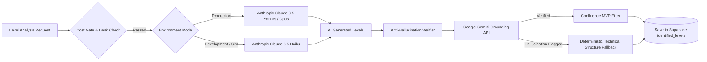

# System Architecture & Technical Design Guide

This document provides a comprehensive overview of the **TradePulse / Trading Platform** architecture, component models, data flow pipelines, database schemas, LLM orchestration, market data integrations, and safety frameworks.

---

## 1. High-Level Architecture

TradePulse is built as a **full-stack, real-time event-driven trading platform** designed for index day traders (DOW / US30, NASDAQ / NAS100, NIKKEI / JP225). It pairs institutional technical analysis (AVWAP, Volume Profile, Liquidity Pools) with multi-model LLM orchestration (Anthropic Claude & Google Gemini) and OANDA broker feeds.

```mermaid
graph TD
    subgraph Frontend [Next.js 14 Dashboard - React 18 + TailwindCSS]
        UI[Trading Chart & Desk UI]
        LV[Live Voice Assistant Component]
        SR[Simulation Replay Controller]
        TJ[Trades Journal & Analytics]
    end

    subgraph API_Layer [Next.js App Router API Endpoints]
        API_Trading[/api/trading/*]
        API_Agents[/api/agents/*]
        API_Levels[/api/levels/*]
        API_LLM[/api/llm/*]
    end

    subgraph Core_Services [TypeScript Service & Trading Logic Layer]
        SG[Session Gate & Attendance]
        LFA[Level Finder Agent & Confluence Gate]
        VP[Volume Profile & AVWAP Engine]
        LVA[Live Voice Context & Reaction Core]
        PE[Position Executor & Risk Guard]
    end

    subgraph LLM_Orchestration [Multi-Provider LLM Engine]
        ANT[Anthropic API - Claude 3.5 Sonnet / Opus / Haiku]
        GEM[Google Gemini API - Verifier & Grounding]
        AH[Anti-Hallucination & Cost Gate Layer]
        TTS[OpenAI Speech TTS / Web Speech API]
    end

    subgraph Data_Providers [Market Data & News Feeds]
        OANDA[OANDA v20 REST & WebSocket Price Stream]
        FH[Finnhub REST API - Sentiment & News]
        YF[Yahoo Finance REST - Fallback Data]
    end

    subgraph Database [Supabase PostgreSQL + RLS]
        DB[(PostgreSQL Database)]
        RLS[Row-Level Security Policies]
        RT[Supabase Realtime WebSockets]
    end

    subgraph Python_Bots [Algorithmic & Backtesting Suite]
        RBL[Range Breakout Ladder Engine]
        AT[Auction Turtle Strategy]
        WF[Walkforward Optimization Pipeline]
    end

    UI <--> API_Layer
    LV <--> API_Layer
    SR <--> API_Layer
    TJ <--> API_Layer

    API_Layer --> Core_Services
    Core_Services <--> Database
    Core_Services <--> LLM_Orchestration
    Core_Services <--> Data_Providers
    Database --- RLS
    Database --- RT
    Python_Bots <--> OANDA
```

---

## 2. Component & Service Architecture

The system is structured in strict vertical slices with modular layers inside [`lib/`](file:///c:/Users/shahb/myApplications/Trading/lib):

```
lib/
├── auth/           # Next.js authentication middleware & Supabase session guards
├── chart/          # Charting utilities, Session VWAP, Volume Profile calculations
├── finnhub/        # Finnhub market news & sentiment analysis client
├── hooks/          # React custom hooks for audio, market data, and stores
├── llm/            # Multi-provider LLM abstraction (Anthropic, Gemini, Verifiers)
├── oanda/          # OANDA REST API client & v20 pricing stream WebSocket consumer
├── services/       # Core business logic services (Level Finder Agent, Validation)
├── speech/         # Text-To-Speech (OpenAI Speech & browser synthesis)
├── stores/         # Client state management (Zustand stores for simulation replays)
├── supabase/       # Supabase SSR and Client SDK instances
├── trading/        # Core trading desk engine, session gates, position management
├── utils/          # Environment variable validation & math helpers
└── yahoo/          # Fallback candle fetcher from Yahoo Finance
```

### Key Service Modules

#### 1. Level Finder & Confluence Engine ([`lib/services/levelFinderAgent/`](file:///c:/Users/shahb/myApplications/Trading/lib/services/levelFinderAgent))
- **Multi-Timeframe Structure Analysis**: Aggregates Daily, 4-Hour, and 1-Hour OHLCV price action.
- **Confluence MVP Gate** ([`lib/trading/levelConfluence.ts`](file:///c:/Users/shahb/myApplications/Trading/lib/trading/levelConfluence.ts)): Evaluates proposed support/resistance levels against three technical pillars:
  1. **Anchored VWAP (AVWAP)**: Exact VWAP standard deviation bands ($\pm 1\sigma, \pm 2\sigma$).
  2. **Volume Profile**: Point of Control (POC) and High Volume Nodes (HVN) computed deterministically ([`lib/chart/volumeProfile.ts`](file:///c:/Users/shahb/myApplications/Trading/lib/chart/volumeProfile.ts)).
  3. **Stop-Pool Liquidity**: Identifies liquidity sweeps beyond obvious retail swing highs/lows.
- **Confluence Threshold**: A level is accepted only if it satisfies $\ge 2$ of the 3 confluence factors.
- **50-Pip Deduplication**: Deduplicates proximal levels within a 50-pip threshold.

#### 2. Desk Session & Attendance Gate ([`lib/trading/sessionGate.ts`](file:///c:/Users/shahb/myApplications/Trading/lib/trading/sessionGate.ts))
- Controls the trading session lifecycle (7:00 AM Pre-Market Prep, 9:00–9:45 AM Core Execution Window, 1:00–4:00 PM Afternoon Session).
- Tracks user attendance, clock-in, and clock-out status ([`lib/trading/deskAttendance.ts`](file:///c:/Users/shahb/myApplications/Trading/lib/trading/deskAttendance.ts)).
- Enforces session rules: blocks entry outside approved windows and halts trade execution if market parameters fail risk criteria.

#### 3. Live Voice AI Assistant ([`lib/trading/liveVoice.ts`](file:///c:/Users/shahb/myApplications/Trading/lib/trading/liveVoice.ts))
- Orchestrates a conversational AI trading assistant during active desk sessions.
- Constructs real-time prompt contexts combining current price, distance to key levels, open positions, P&L, and news sentiment ([`lib/trading/liveVoiceContext.ts`](file:///c:/Users/shahb/myApplications/Trading/lib/trading/liveVoiceContext.ts)).
- Generates immediate voice responses using OpenAI TTS audio synthesis ([`lib/speech/openaiSpeech.ts`](file:///c:/Users/shahb/myApplications/Trading/lib/speech/openaiSpeech.ts)) or Web Speech API fallback.

#### 4. OANDA Broker & Market Data Integration ([`lib/oanda/`](file:///c:/Users/shahb/myApplications/Trading/lib/oanda))
- **REST Client**: Fetches historical OHLC candles for M5, H1, H4 timeframes ([`lib/oanda/candles.ts`](file:///c:/Users/shahb/myApplications/Trading/lib/oanda/candles.ts)).
- **WebSocket Streaming**: Maintains live tick-by-tick v20 price streaming ([`lib/oanda/pricingStream.ts`](file:///c:/Users/shahb/myApplications/Trading/lib/oanda/pricingStream.ts)).
- **Order Execution**: Submits limit/market orders with attached Stop-Loss and Take-Profit brackets ([`lib/oanda/orders.ts`](file:///c:/Users/shahb/myApplications/Trading/lib/oanda/orders.ts)).

---

## 3. LLM Orchestration & AI Grounding Layer

The platform utilizes a **hybrid multi-LLM architecture** designed to maximize level detection accuracy while strictly preventing hallucinations and managing API token costs.



### LLM Architecture Specifications:
1. **Tiered Model Selection**:
   - Live/Production Desk: Anthropic Claude 3.5 Sonnet / Opus.
   - Simulation & Testing: Claude 3.5 Haiku for lower latency and cost efficiency.
2. **Anti-Hallucination & Verification** ([`lib/llm/antiHallucination.ts`](file:///c:/Users/shahb/myApplications/Trading/lib/llm/antiHallucination.ts)):
   - Cross-verifies level coordinates against numerical candle boundaries.
   - Google Gemini grounding module ([`lib/llm/verifier.ts`](file:///c:/Users/shahb/myApplications/Trading/lib/llm/verifier.ts)) inspects raw AI responses for price output precision.
3. **Usage Logging & Cost Sentinel** ([`lib/llm/usageLog.ts`](file:///c:/Users/shahb/myApplications/Trading/lib/llm/usageLog.ts)):
   - Logs prompt tokens, completion tokens, and dollar costs to the `llm_usage` Supabase table.
   - Circuit breakers automatically throttle AI calls if daily token usage exceeds pre-set cost gates.

---

## 4. Database Schema & Security Architecture

Database functionality is powered by **Supabase PostgreSQL** with strict **Row-Level Security (RLS)** policies for user isolation across 25 schema migrations.

### Key Database Tables

| Table Name | Primary Purpose | Key Fields | RLS Isolation |
| :--- | :--- | :--- | :--- |
| `profiles` | User profiles & trading mode preference | `id`, `email`, `trading_mode ('paper'\|'live')` | Authenticated user (`auth.uid() = id`) |
| `sessions` | Daily trading sessions | `id`, `user_id`, `date`, `index_recommendation` | Authenticated user (`user_id`) |
| `identified_levels` | AI & deterministic technical levels | `id`, `session_id`, `user_id`, `level`, `type`, `conviction`, `reasoning` | Authenticated user (`user_id`) |
| `level_history` | Historical performance of identified levels | `id`, `user_id`, `level`, `tested_count`, `last_verdict`, `last_outcome` | Authenticated user (`user_id`) |
| `level_breaks` | Detected level breach events | `id`, `instrument`, `level`, `direction`, `confidence`, `break_price` | Global/Desk Read-Only |
| `positions` | Open and closed trade positions | `id`, `user_id`, `side`, `entry_price`, `stop_loss`, `take_profit`, `pnl_dollars` | Authenticated user (`user_id`) |
| `trades_journal` | Detailed trade log & post-trade reviews | `id`, `user_id`, `position_id`, `notes`, `rating`, `execution_discipline` | Authenticated user (`user_id`) |
| `monitoring_events` | Real-time trade audit trail | `id`, `position_id`, `event_type`, `price`, `description` | Authenticated user via position linkage |
| `live_voice_sessions` | Transcripts and voice assistant history | `id`, `user_id`, `session_id`, `transcript`, `pins` | Authenticated user (`user_id`) |
| `simulation_replays` | Historical market simulation states | `id`, `user_id`, `playback_speed`, `current_timestamp` | Authenticated user (`user_id`) |
| `llm_usage` | Token and cost tracking | `id`, `user_id`, `model`, `tokens_used`, `cost_usd` | Authenticated user (`user_id`) |

---

## 5. Security & Risk Discipline Rules

1. **Paper Trading Default**:
   - All new users start in **Paper Mode** by default.
   - Live trading mode requires explicit user configuration via `PATCH /api/settings/trading-mode`.
2. **Single-Position Lock**:
   - The platform enforces a strict single active position policy. Submitting a new trade while a position is open is rejected by the position manager ([`lib/trading/positionManager.ts`](file:///c:/Users/shahb/myApplications/Trading/lib/trading/positionManager.ts)).
3. **Mandatory Bracket Orders**:
   - Every order **must** specify an explicit Stop Loss (SL) and Take Profit (TP). Unprotected market entries are strictly forbidden.
4. **Row-Level Security (RLS)**:
   - All user data tables implement Supabase RLS. Queries strictly require a valid JWT token associated with the authenticated user ID.

---

## 6. Python Algorithmic & Backtesting Suite ([`bots/`](file:///c:/Users/shahb/myApplications/Trading/bots))

The codebase includes a Python quantitative suite for offline strategy research, auction market structure analysis, and strategy optimization:

- **`optimize_auction.py`**: Optimizes auction market profile parameters across historical market sessions.
- **`run_backtest.py`**: Executes historical backtests on index price feeds.
- **`run_rbl_walkforward.py`**: Executes walk-forward optimizations for Range Breakout Ladder strategies.
- **`bots/nyc_range_turtle/`**:
  - `auction_turtle.py`: Implements Auction Market Theory combined with Turtle breakout rules.
  - `range_breakout_ladder.py`: Multi-tier range breakout execution algorithm.
  - `ib_mean_reversion.py`: Initial Balance (IB) mean-reversion strategy.
  - `volume_profile.py`: Python volume profile calculator for historical datasets.
  - `oanda_client.py`: Python OANDA REST API wrapper for downloading historical tick and candle data.

---

## 7. Technology Stack Summary

- **Frontend**: Next.js 14 (App Router), React 18, Tailwind CSS, Lightweight Charts (`lightweight-charts`), Recharts.
- **Backend / API**: Next.js Serverless Routes, TypeScript (Strict Mode).
- **State & Data Fetching**: SWR (`swr`), Zustand (`zustand`).
- **Database & Storage**: Supabase PostgreSQL, Supabase Realtime, Supabase Auth, Row-Level Security (RLS).
- **AI / LLM Orchestration**: `@anthropic-ai/sdk`, Google Gemini API, OpenAI Speech TTS.
- **Market Data Feeds**: OANDA v20 REST & WebSocket APIs, Finnhub API (News Sentiment), Yahoo Finance API.
- **Testing & Scripts**: Node.js ES Modules (`scripts/`), Python 3 (`bots/`), Vitest / Jest test suite (`__tests__/`).
