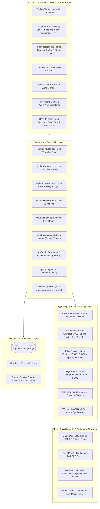

# System Architecture & Technical Design Guide

> **TradePulse Institutional Trading Desk**  
> **Framework**: Next.js 14 (App Router) + React 18 + TypeScript (Strict Mode)  
> **Database & Realtime**: Supabase PostgreSQL + Row-Level Security (RLS)  
> **Charting Engine**: Lightweight Charts v4 (TradingView) + HTML5 2D Canvas Overlays  
> **Audio Synthesis**: Web Audio API Dual-Tone Chime Synthesis  
> **Timezone Standard**: Montreal Civil Time (America/Toronto / EDT - UTC-4)  

---

## 1. High-Level Architecture & System Topology

TradePulse is an event-driven institutional day and swing trading workstation. It integrates multi-source market data pipelines (CME Globex MDP 3.0 via Databento, OANDA continuous CFDs with CME basis adjustments, and Yahoo Finance Daily macro history), proprietary auction market analytics (5-Month Anchored VWAP, 5-Day FRVP, Initial Balance, Dalton Spikes), broker portfolio tracking (Questrade live OAuth & TopstepX prop firm challenge), and an intelligent trading copilot (Leo AI with persistent Long-Term Memory zones).


```mermaid
graph TD
    subgraph Client [Frontend Workstation - Next.js 14 App Router]
        TC[TradingChart - Lightweight Charts v4]
        CO[HTML5 Canvas Overlay Layer - Sessions, Spikes, Extremes, FRVP]
        HUD[Chart Toolbar, Timeframe Selector, Tooltip & Status HUD]
        CVD[Cumulative Volume Delta Sub-Pane]
        LEO_UI[Leo AI Chat & Memory Zone Manager]
        NOTIF[Notifications Center & Audio Alert Dispatcher]
        DESK[Desk Journal, Swing Positions, Team Tape & Book Cards]
    end

    subgraph API_Gateway [Next.js App Router API Layer]
        API_Candles["/api/trading/candles (Multi-TF Market Data)"]
        API_Stream["/api/trading/quote/stream (SSE Live Stream)"]
        API_Context["/api/trading/context-55 (5M AVWAP, YDay NYC, ON)"]
        API_Positions["/api/trading/current-position & positions/*"]
        API_Questrade["/api/trading/questrade/book (Live Broker)"]
        API_Journal["/api/trading/journal & sim-journal (TopstepX Sync)"]
        API_Tape["/api/trading/team-tape & ingest (Multi-Day Swings)"]
        API_Leo["/api/trading/leo/chat, memories, notify"]
        API_Desk["/api/trading/clock-in, clock-out, session-gate, playbook"]
    end

    subgraph Market_Data [Market Data Hierarchy & Settlement Alignment]
        DB_CME[Databento - CME Globex MDP 3.0 Futures Feeds]
        OANDA_CFD[OANDA v20 - Continuous 24/7 CFD Pricing]
        CME_BASIS[Dynamic CME Basis Calculator & Spot-Futures Offset]
        YF_DAILY[Yahoo Finance - Multi-Year Daily Macro History]
    end

    subgraph Core_Services [TypeScript Service & Strategy Layer]
        CANDLE_NORM[Candle Normalizer & Time Shifter toChartTime]
        AVWAP_ENG[5-Month & Session Anchored VWAP Engine with ±1σ, ±2σ, ±3σ]
        AUCTION_ENG[Dalton Auction Market Engine - IB, OR15, OR30, Spikes, Extremes]
        PAIRING_ENG[Intelligent TP/SL Bracket Pairing Engine with Price Sanity]
        LTM_ENG[Leo Long-Term Memory & Proximity Scanner]
        AUDIO_SYNTH[Web Audio API Dual-Tone Chime Synthesizer]
    end

    subgraph Storage [Database & Persistence Layer]
        SUPABASE[(Supabase PostgreSQL)]
        RLS[Row-Level Security Policies]
        SESSION_CACHE[Browser SessionStorage Viewport & State Cache]
    end

    Client <--> API_Gateway
    API_Gateway --> Core_Services
    Core_Services --> Market_Data
    API_Gateway --> Storage
```

---

## 2. Component Boundaries & Unidirectional Data Flow

### 2.1 Client-Side Rendering Strategy
- **Client Components (`'use client'`)**:
  - `TradingChart.tsx`: Houses the primary Lightweight Charts container, HTML5 transparent canvas overlay, live crosshair tooltips, CVD sub-pane, and interactive drawing tools.
  - `DashboardPositionsClient.tsx`: Real-time execution dashboard showing active positions, working limit orders, live P&L, stop-loss / take-profit bracket controls, and manual flatten triggers.
  - `QuestradeBookCard.tsx`: Displays live broker equity, open multi-day swing positions, and execution metrics.
  - `DashboardNotifications.tsx`: Real-time alarm banner feed and memory breach logs.
  - `LeoChat.tsx`: Conversational AI copilot interface.
- **Server Components & Route Handlers**:
  - All routes under `app/api/` execute server-side within the Next.js Node.js runtime, ensuring that sensitive API keys (OANDA, Databento, Anthropic, Questrade, Supabase Service Role) are never exposed to the client browser.

### 2.2 Reactivity Without UI Freezing
High-frequency market data streams (quotes every 250ms to 1s) can easily trigger severe React reconciliation lag if handled via standard `useState` hooks. TradePulse employs an imperative, decoupled rendering architecture:
1. **Direct Series Mutations**: Live quotes call `candleSeries.update()` directly via mutable React references (`candleRef.current`, `volumeSeriesRef.current`, `vwapSeriesRef.current`).
2. **Animation Frame Scheduling (`requestAnimationFrame`)**: Canvas overlays (session boxes, FRVP histograms, Dalton spike markers, daily extremes) schedule rendering passes using `requestAnimationFrame`, throttling canvas repaints to the monitor refresh rate (60Hz / 120Hz).
3. **Dedicated Canvas Layers**: Rather than creating thousands of DOM elements for chart annotations, overlays are rendered onto stacked `<canvas>` elements positioned directly above the Lightweight Charts pane.
4. **Timeframe State Isolation**: Switching timeframes (`1m`, `5m`, `30m`, `1D`) explicitly purges cached timestamps, resets seeded price lines, and clears intraday series before mounting the new resolution.

---

## 3. Real-Time Price Streaming & Forming Bar Architecture

```
[Live Broker / Exchange Feed]
            │
            ▼
   GET /api/trading/quote/stream (Server-Sent Events)
            │  (Pushes { price, high, low, volume, timestamp } every ~500ms)
            ▼
     TradingChart.tsx
            │
            ├─► candleRef.current.update(...) [Zero React Re-render]
            ├─► volumeSeriesRef.current.update(...)
            ├─► Live Price Line & HUD Tag Update
            ├─► Proximity Check against Leo Long-Term Memory Zones
            └─► If Memory Breached: Trigger Web Audio Dual-Tone Chime & Alert Banner
```

### 3.1 Server-Sent Events (SSE) Pipeline
- The `/api/trading/quote/stream` endpoint streams lightweight JSON payloads containing live bid, ask, last price, volume, and tick timestamps.
- When an incoming tick arrives within the active candle window, `update()` imperatively extends the forming bar's high, low, close, and volume.
- When the candle closes (elapsed timestamp $\ge \text{barSeconds}$), a new bar is appended cleanly without fetching the entire history.

### 3.2 Time Coordinate Shifting (`toChartTime`)
Lightweight Charts treats all input timestamps as UTC for internal coordinate math. To display the trader's local civil time (Montreal / America/Toronto EDT) without timezone conversion bugs on the axis:
- Incoming Unix timestamps are shifted via `toChartTime(unixSec, 'America/Toronto')` so that their UTC date/time components match the Montreal wall clock.
- Chart formatters read UTC getters (`getUTCHours()`, `getUTCMinutes()`, `getUTCDate()`), eliminating daylight savings offsets.
- On Daily charts (`1D`), the time scale disables clock times (`timeVisible: false`) and formats ticks purely as calendar dates (`Sep 14, 2026`).

---

## 4. Database Schema & Security Architecture

### 4.1 Supabase PostgreSQL Structure
The platform utilizes a structured relational schema enforcing strict Row-Level Security (RLS):
- `profiles`: Trader identity, account configuration, risk parameters.
- `positions`: Real-time and historical trade records, entry/exit prices, stop loss, take profit, realized P&L, status (`open`, `closed`, `working`).
- `leo_long_term_memories`: Higher Timeframe zones, support/resistance levels, trading notes, alarm status.
- `team_signals`: Shared desk swing ideas and copy trading advice.
- `desk_attendance`: Clock-in/out timestamps, trading discipline logs.

### 4.2 Row-Level Security (RLS) Policies
- All database interactions are gated by authenticated user IDs (`auth.uid() = user_id`).
- Server-side administrative routes use the Supabase Service Role client strictly when performing authenticated background tasks.

---

## 5. Technology Stack Summary

| Layer | Technologies | Key Responsibility |
| :--- | :--- | :--- |
| **Frontend Framework** | Next.js 14.2, React 18 | App Router, Server Components, Client Workstation |
| **Styling & HUD** | TailwindCSS 3.4, Lucide Icons | Responsive institutional trading theme (`#0d1117`) |
| **Financial Charting** | Lightweight Charts v4, HTML5 Canvas 2D | Candlestick rendering, indicators, volume profiles |
| **Audio Engine** | Web Audio API (`AudioContext`) | Real-time dual-tone synthesizers, zero latency |
| **Market Data Providers**| Databento, OANDA v20, Yahoo Finance | CME Globex MDP 3.0, 24/7 CFDs, Daily macro data |
| **Broker Integrations** | Questrade API, TopstepX | OAuth portfolio sync, prop firm challenge tracking |
| **Database & Auth** | Supabase (PostgreSQL, RLS) | Secure persistence, session auth, audit logs |
| **Language & Runtime** | TypeScript 5.4, Node.js 18+ | Strict type safety, deterministic mathematical execution |
