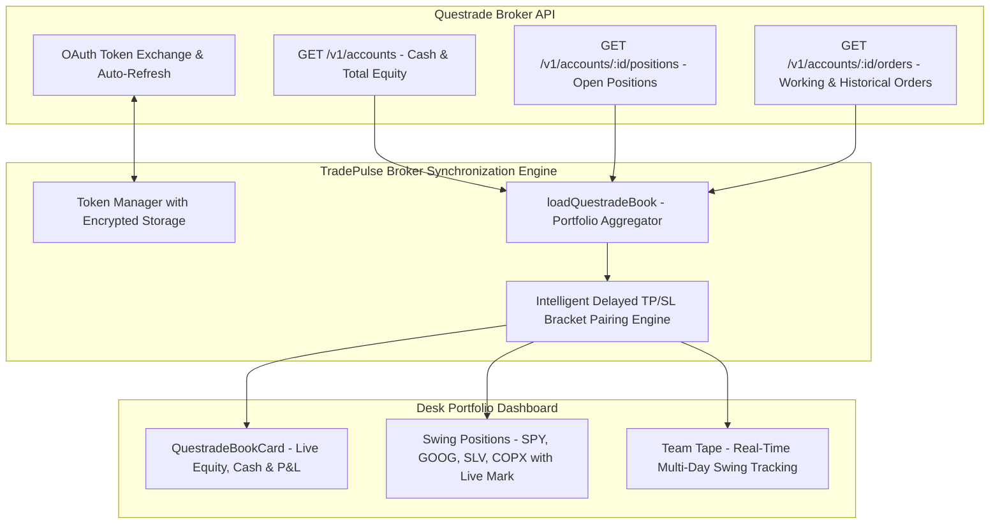

# Broker & Prop Firm Integrations: Questrade & TopstepX

> **TradePulse Execution & Portfolio Layer**  
> **Live Broker Integration**: Questrade (OAuth API, Multi-Day Swings, Intelligent Delayed TP/SL Pairing)  
> **Prop Firm Integration**: TopstepX ($1,500 Challenge, Zero-Base Prop Equity Engine, 66 Trades Ledger)  

---

## 1. Questrade Live Broker Integration

TradePulse integrates directly with **Questrade's REST API** for live equity tracking, multi-day swing position monitoring, and execution order management.



### 1.1 Authentication & Auto-Refresh Flow
- **Initial Setup**: The trader provides a one-time API refresh token via `QUESTRADE_REFRESH_TOKEN`.
- **Token Exchange (`lib/questrade/auth.ts`)**: Exchanges the refresh token for a short-lived bearer access token and a new refresh token. Tokens are stored securely and refreshed automatically before expiration.

### 1.2 Multi-Day Position Persistence
Unlike intraday scalps that flatten at 16:59 EDT, swing equity positions (e.g. SPY, GOOG, SLV, COPX) are held across multi-day and multi-week horizons:
- `loadQuestradeBook` queries all open positions regardless of their original fill date.
- Open positions are mapped into `/api/trading/team-tape`, ensuring they are continuously tracked with live marks, average entry prices, and open P&L.

---

## 2. Intelligent Delayed TP/SL Bracket Pairing (`lib/trading/questradeOrders.ts`)

### 2.1 The Delayed Order Pairing Problem
In Questrade and many retail brokerages:
- Take-Profit (Sell Limit) and Stop-Loss (Sell Stop) orders are frequently placed **hours, days, or weeks after the initial position was filled** (e.g. SPY entered on Aug 20 @ 765; TP Limit @ 772 placed on Sep 9).
- These delayed orders **do not contain broker `parentId` or `orderGroupId` links** connecting them back to the original entry order.
- Naive matching engines either fail to find the bracket orders or mistakenly attach open position targets to unexecuted working buy limits (e.g. assigning a 772 target to an unfilled Buy 1 SPY @ 765 limit).

### 2.2 Solution: Multi-Factor Pairing Algorithm
TradePulse implements a multi-factor pairing algorithm:

```
[Candidate Order]
        │
        ▼
   Price Relationship Sanity Check
   ├── Long Position:  Take Profit > Entry  AND  Stop Loss < Entry
   └── Short Position: Take Profit < Entry  AND  Stop Loss > Entry
        │ (Fails sanity? -> Disqualified)
        ▼
   Recency & Status Scoring
   ├── Active 'Working' orders: +100 base score
   ├── Recency weight: (orderPlacedEpoch / 1e10) * 10
   └── Quantity match: +20 bonus if order.qty === position.qty
        │
        ▼
   Unexecuted Limit Isolation
   └── Working entry limits require explicit bracket IDs;
       they are NEVER assigned an open position's targets.
```

### 2.3 Empirical Verification
Verified against live Questrade account data:
- **SPY**: Long entry 765 $\rightarrow$ accurately paired with TP Sell Limit @ 772 (placed 20 days later).
- **GOOG**: Long entry 345 $\rightarrow$ accurately paired with TP Sell Limit @ 350 (placed 13 days later).
- **SLV**: Long entry 58.49 $\rightarrow$ accurately identified with no active stop/target (`stop: null, target: null`).
- **COPX**: Long entry 89.52 $\rightarrow$ accurately identified with no active stop/target (`stop: null, target: null`).
- **Unexecuted Working Limits** (e.g. Buy 1 GOOG @ 330, Buy 1 SPY @ 750) strictly maintain `target: null, stop: null`.

---

## 3. TopstepX Prop Firm Challenge ($1,500 Target)

TradePulse provides automated synchronization with the official **TopstepX $1,500 Challenge**:

```
┌────────────────────────────────────────────────────────────────────────┐
│ 🏆 TOPSTEPX 1.5K CHALLENGE (Account: 1.5KCHCR-LABS004-V2-675081-67067724)│
├────────────────────────────────────────────────────────────────────────┤
│ Live P&L:      +$183.64        Target:         +$1,500.00              │
│ Max Loss Floor: -$500.00        Live Cushion:   $683.64 (Safe)          │
│ Total Trades:  66 Executions   Win Rate:       56.06% (37W / 29L)      │
│ Profit Factor: 1.23            Direction:      48 Long / 18 Short      │
└────────────────────────────────────────────────────────────────────────┘
```

### 3.1 Zero-Base Prop Firm Equity Architecture
- Standard broker accounts start with cash balances (e.g. $50,000).
- Prop firm challenge accounts operate on a **zero-base evaluation scale**:
  - The challenge goal is to generate **+$1,500.00 in cumulative net P&L**.
  - The failure boundary (Max Loss Limit / MLL) is **-$500.00 in net P&L**.
- In `lib/trading/journalHistory.ts`, TradePulse supports `account_size: 0`:
  - Prevents the UI from adding an arbitrary $50,000 base.
  - Correctly renders equity as `$183.64` and live cushion as:
    $$\text{Live Cushion} = \text{Current Net P\&L} - \text{MLL Floor} = 183.64 - (-500.00) = \$683.64$$

### 3.2 66-Trade Verified Ledger
The challenge metrics are backed by 66 verified trades:

| Metric | Official TopstepX Value |
| :--- | :--- |
| **Net P&L** | **+$183.64** |
| **Total Orders** | **66 Executed Orders (68 Total Lots)** |
| **Win Rate** | **56.06% (37 Wins / 29 Losses)** |
| **Profit Factor** | **1.23** (-$803.92 losses / +$987.56 wins) |
| **Avg Win / Loss** | **+$26.69** / **-$27.72** |
| **Best / Worst** | **+$134.58** / **-$59.04** |
| **Trade Direction** | **72.73% Long (48 Long / 18 Short)** |

#### Daily Performance Ledger
- **2026-09-08**: -$231.50 (Initial consolidation drawdown)
- **2026-09-09**: +$274.12 (Strong morning trend expansion)
- **2026-09-10**: +$109.34 (Disciplined scalps)
- **2026-09-11**: +$31.68 (Continuation gains)
- **Total Cumulative Net Return**: **+$183.64**
