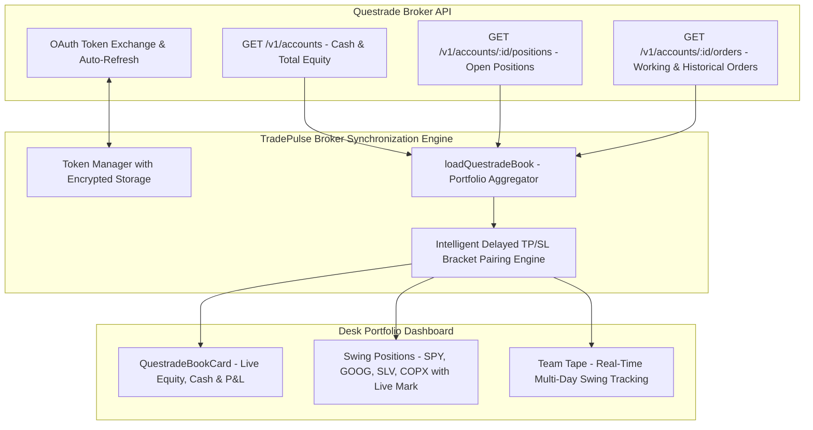

# Broker & Futures Integrations: Questrade & Institutional Ledger

> **TradePulse Execution & Portfolio Layer**  
> **Live Broker Integration**: Questrade (OAuth API, Multi-Day Swings, Intelligent Delayed TP/SL Pairing)  
> **Futures Ledger Integration**: Personal Futures Desk Ledger & Daily Equity Engine  

---

## 1. Questrade Live Broker Integration

TradePulse integrates directly with **Questrade's REST API** for live equity tracking, multi-day swing position monitoring, and execution order management.


```mermaid
graph TD
    subgraph Questrade_API [Questrade Broker API]
        AUTH[OAuth Token Exchange & Auto-Refresh]
        ACC_REQ[GET /v1/accounts - Cash & Total Equity]
        POS_REQ[GET /v1/accounts/:id/positions - Open Positions]
        ORD_REQ[GET /v1/accounts/:id/orders - Working & Historical Orders]
    end

    subgraph TradePulse_Engine [TradePulse Broker Synchronization Engine]
        TOKEN_MGR[Token Manager with Encrypted Storage]
        BOOK_LOADER[loadQuestradeBook - Portfolio Aggregator]
        PAIRING_ENG[Intelligent Delayed TP/SL Bracket Pairing Engine]
    end

    subgraph Client_UI [Desk Portfolio Dashboard]
        BOOK_CARD[QuestradeBookCard - Live Equity, Cash & P&L]
        SWING_CARD[Swing Positions - SPY, GOOG, SLV, COPX with Live Mark]
        TEAM_TAPE[Team Tape - Real-Time Multi-Day Swing Tracking]
    end

    AUTH <--> TOKEN_MGR
    ACC_REQ & POS_REQ & ORD_REQ --> BOOK_LOADER
    BOOK_LOADER --> PAIRING_ENG
    PAIRING_ENG --> BOOK_CARD & SWING_CARD & TEAM_TAPE
```

### 1.1 Authentication & Auto-Refresh Flow
- **Initial Setup**: The trader provides a one-time API refresh token via `QUESTRADE_REFRESH_TOKEN`.
- **Token Exchange (`lib/questrade/auth.ts`)**: Exchanges the refresh token for a short-lived bearer access token and a new refresh token. Tokens are stored securely and refreshed automatically before expiration.

### 1.2 Multi-Day Position Persistence
Unlike intraday scalps that flatten at 16:59 EDT, swing equity positions (e.g. SPY, GOOG, SLV, COPX) are held across multi-day and multi-week horizons:
- `loadQuestradeBook` queries all open positions regardless of their original fill date.
- Open positions are mapped into `/api/trading/team-tape`, ensuring they are continuously tracked with live marks, average entry prices, and open P&L.

---

## 2. Intelligent Delayed TP/SL Bracket Pairing (`lib/trading/questradeOrders.ts`)

### 2.1 The Delayed Order Pairing Problem
In Questrade and many retail brokerages:
- Take-Profit (Sell Limit) and Stop-Loss (Sell Stop) orders are frequently placed **hours, days, or weeks after the initial position was filled** (e.g. SPY entered on Aug 20 @ 765; TP Limit @ 772 placed on Sep 9).
- These delayed orders **do not contain broker `parentId` or `orderGroupId` links** connecting them back to the original entry order.
- Naive matching engines either fail to find the bracket orders or mistakenly attach open position targets to unexecuted working buy limits (e.g. assigning a 772 target to an unfilled Buy 1 SPY @ 765 limit).

### 2.2 Solution: Multi-Factor Pairing Algorithm
TradePulse implements a multi-factor pairing algorithm:

```
[Candidate Order]
        │
        ▼
   Price Relationship Sanity Check
   ├── Long Position:  Take Profit > Entry  AND  Stop Loss < Entry
   └── Short Position: Take Profit < Entry  AND  Stop Loss > Entry
        │ (Fails sanity? -> Disqualified)
        ▼
   Recency & Status Scoring
   ├── Active 'Working' orders: +100 base score
   ├── Recency weight: (orderPlacedEpoch / 1e10) * 10
   └── Quantity match: +20 bonus if order.qty === position.qty
        │
        ▼
   Unexecuted Limit Isolation
   └── Working entry limits require explicit bracket IDs;
       they are NEVER assigned an open position's targets.
```

### 2.3 Empirical Verification
Verified against live Questrade account data:
- **SPY**: Long entry 765 $\rightarrow$ accurately paired with TP Sell Limit @ 772 (placed 20 days later).
- **GOOG**: Long entry 345 $\rightarrow$ accurately paired with TP Sell Limit @ 350 (placed 13 days later).
- **SLV**: Long entry 58.49 $\rightarrow$ accurately identified with no active stop/target (`stop: null, target: null`).
- **COPX**: Long entry 89.52 $\rightarrow$ accurately identified with no active stop/target (`stop: null, target: null`).
- **Unexecuted Working Limits** (e.g. Buy 1 GOOG @ 330, Buy 1 SPY @ 750) strictly maintain `target: null, stop: null`.

---

## 3. Personal Futures Desk Ledger & Equity Architecture

TradePulse maintains continuous telemetry and risk analytics for the personal futures desk ledger:

```
┌────────────────────────────────────────────────────────────────────────┐
│ 📊 FUTURES DESK LEDGER (Personal Account)                              │
├────────────────────────────────────────────────────────────────────────┤
│ Desk Balance:  $50,000.00      Daily Loss Limit:  $500.00               │
│ Risk per Trade: $50.00         Max Daily Fills:   5 Fills               │
│ Mode:          Read-Only       Execution:         Disabled (Zero Orders)│
└────────────────────────────────────────────────────────────────────────┘
```

### 3.1 Strict Read-Only Market Telemetry
- TradePulse operates exclusively in **Read-Only Market Monitoring Mode**.
- Neither Leo AI nor the user interface submits live order tickets to brokers.
- Signals, Wyckoff structural alerts, and risk telemetry are delivered as decision-support guidance for manual off-platform execution.
