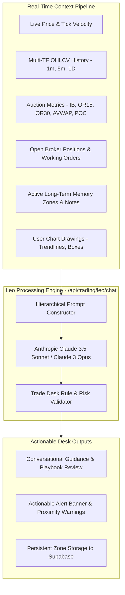

# Leo AI Assistant, Long-Term Memory & Web Audio Alerts

> **TradePulse Intelligence & Audio Alerting Infrastructure**  
> **AI Copilot**: Leo — Multi-Tier Contextual Trading Assistant  
> **Memory Architecture**: Persistent Higher-Timeframe Long-Term Memory (LTM) Zones  
> **Sound Engine**: Web Audio API Procedural Two-Tone Chime Synthesis (Zero MP3 Assets)  

---

## 1. Leo AI Assistant Architecture

Leo is TradePulse's native AI trading copilot and risk advisor. Unlike generic chatbots, Leo operates with continuous access to live chart state, market structure, open broker positions, and user-defined memory zones.



### 1.1 Hierarchical Prompt System
Leo's system prompt (`lib/ai/leoAssistant.ts`) enforces strict trading desk principles:
- **Higher-Timeframe Primacy**: Evaluates Daily (`1D`) structural levels as major institutional pivot zones rather than short-term scalp noise.
- **Auction Market Context**: Evaluates price relative to the 5-Month Anchored VWAP, Day POC, and Initial Balance.
- **Disciplined Execution**: Discourages overtrading, warns when Daily Loss Limits are near, and validates that stop-loss orders are placed at structural levels.

---

## 2. Long-Term Memory (LTM) Architecture

Traders frequently identify critical weekly, monthly, or daily inflection zones that must remain remembered for days or weeks.

```
┌────────────────────────────────────────────────────────┐
│  🧠 LEO MEMORY: Major Weekly Absorption [🔔 ALARM ON]  │
├────────────────────────────────────────────────────────┤
│  Price High: 44,850.00                                 │
│  Price Low:  44,720.00                                 │
│  Notes: Watch for buyer absorption; break targets POC. │
└────────────────────────────────────────────────────────┘
```

### 2.1 Memory Zone Structure (`lib/trading/leoLongTermMemory.ts`)
Each memory zone stores:
- `id`: Unique identifier.
- `instrument`: Associated asset (`DOW`, `NASDAQ`, `GOLD`, etc.).
- `priceHigh` & `priceLow`: Zone boundaries.
- `purpose`: High-level tactical description (e.g. "Weekly Absorption Zone").
- `notes`: Detailed trader notes and game plan.
- `alarmEnabled`: Boolean flag triggering audio chimes upon visit.
- `lastAlertAt`: Timestamp of the last alert (enforces a 90-second debounce cooldown).

### 2.2 1-Click Zone Creation
- When the trader draws a **Range Box** on the chart, the drawing toolbar displays a `🧠 Activate Long-Term Memory` button.
- Clicking this instantly attaches memory metadata, prompts for tactical notes, activates the audio alarm, and persists the zone to Supabase and browser cache.

---

## 3. Real-Time Proximity Scanner & Web Audio Chime Synthesis

### 3.1 Proximity Scanner Logic
Every incoming price tick is evaluated against active memory zones:
1. Checks if `price >= memory.priceLow && price <= memory.priceHigh`.
2. Verifies that `memory.alarmEnabled === true`.
3. Checks that `Date.now() - memory.lastAlertAt > 90,000ms` (cooldown guard).
4. If triggered:
   - Sets `memory.lastAlertAt = Date.now()`.
   - Triggers the Web Audio synthesizer.
   - Pushes an actionable alert banner to the HUD and Dashboard Notifications center.

### 3.2 Web Audio API Procedural Synthesizer (`lib/chart/soundEffects.ts`)
Rather than relying on external MP3/WAV files (which suffer from browser caching issues, network latency, and autoplay blocking), TradePulse generates an authentic **TradingView-style dual-tone chime** directly in memory using the Web Audio API (`AudioContext`):

```typescript
export function playTradingViewChime(): void {
  const ctx = getAudioContext()
  const now = ctx.currentTime

  // Tone 1: Fundamental A5 (880 Hz)
  const osc1 = ctx.createOscillator()
  const gain1 = ctx.createGain()
  osc1.type = 'sine'
  osc1.frequency.setValueAtTime(880, now)
  gain1.gain.setValueAtTime(0.28, now)
  gain1.gain.exponentialRampToValueAtTime(0.001, now + 0.38)
  osc1.connect(gain1); gain1.connect(ctx.destination)
  osc1.start(now); osc1.stop(now + 0.40)

  // Tone 2: Harmonic E6 (1318.51 Hz) + Upper Shimmer (1760 Hz)
  const osc2 = ctx.createOscillator()
  const gain2 = ctx.createGain()
  osc2.type = 'sine'
  osc2.frequency.setValueAtTime(1318.51, now + 0.12)
  gain2.gain.setValueAtTime(0.32, now + 0.12)
  gain2.gain.exponentialRampToValueAtTime(0.001, now + 0.58)
  osc2.connect(gain2); gain2.connect(ctx.destination)
  osc2.start(now + 0.12); osc2.stop(now + 0.60)
}
```

- **Acoustic Characteristics**: Two pure sinusoidal tones spaced by a perfect fifth (A5 -> E6), producing the crisp, pleasant, and instantly recognizable TradingView alert chime.
- **Latency**: Sub-millisecond instantaneous trigger.
- **Zero Assets**: Operates completely offline with 0KB of downloaded audio assets.

---

## 4. Notifications Center & In-Chart Banners

- **Floating Alert Banners**: When price breaches a memory zone, a high-contrast toast banner appears at the top of the chart with an `Ask Leo` quick-action button, instantly populating Leo's chat with the memory context.
- **Dashboard Notifications Center (`DashboardNotifications.tsx`)**: An embedded live feed on the dashboard home page logging all recent breach events, chime test triggers, and active memory zone management.
