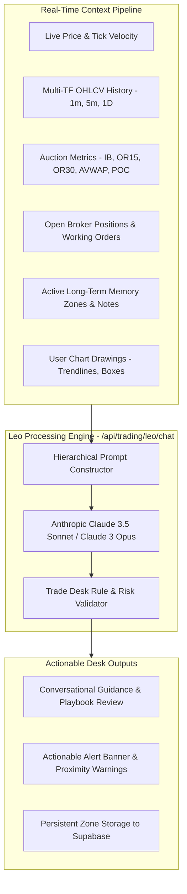

# Leo AI Assistant, Long-Term Memory & Web Audio Alerts

> **TradePulse Intelligence & Audio Alerting Infrastructure**  
> **AI Copilot**: Leo — Multi-Tier Contextual Trading Assistant  
> **Memory Architecture**: Persistent Higher-Timeframe Long-Term Memory (LTM) Zones  
> **Sound Engine**: Web Audio API Procedural Two-Tone Chime Synthesis (Zero MP3 Assets)  

---

## 1. Leo AI Assistant Architecture

Leo is TradePulse's native AI trading copilot and risk advisor. Unlike generic chatbots, Leo operates with continuous access to live chart state, market structure, open broker positions, and user-defined memory zones.



### 1.1 Hierarchical Prompt System
Leo's system prompt (`lib/ai/leoAssistant.ts`) enforces strict trading desk principles:
- **Higher-Timeframe Primacy**: Evaluates Daily (`1D`) structural levels as major institutional pivot zones rather than short-term scalp noise.
- **Auction Market Context**: Evaluates price relative to the 5-Month Anchored VWAP, Day POC, and Initial Balance.
- **Disciplined Execution**: Discourages overtrading, warns when Daily Loss Limits are near, and validates that stop-loss orders are placed at structural levels.

---

## 2. Long-Term Memory (LTM) Architecture

Traders frequently identify critical weekly, monthly, or daily inflection zones that must remain remembered for days or weeks.

```
┌────────────────────────────────────────────────────────┐
│  🧠 LEO MEMORY: Major Weekly Absorption [🔔 ALARM ON]  │
├────────────────────────────────────────────────────────┤
│  Price High: 44,850.00                                 │
│  Price Low:  44,720.00                                 │
│  Notes: Watch for buyer absorption; break targets POC. │
└────────────────────────────────────────────────────────┘
```

### 2.1 Memory Zone Structure (`lib/trading/leoLongTermMemory.ts`)
Each memory zone stores:
- `id`: Unique identifier.
- `instrument`: Associated asset (`DOW`, `NASDAQ`, `GOLD`, etc.).
- `priceHigh` & `priceLow`: Zone boundaries.
- `purpose`: High-level tactical description (e.g. "Weekly Absorption Zone").
- `notes`: Detailed trader notes and game plan.
- `alarmEnabled`: Boolean flag triggering audio chimes upon visit.
- `lastAlertAt`: Timestamp of the last alert (enforces a 90-second debounce cooldown).

### 2.2 1-Click Zone Creation
- When the trader draws a **Range Box** on the chart, the drawing toolbar displays a `🧠 Activate Long-Term Memory` button.
- Clicking this instantly attaches memory metadata, prompts for tactical notes, activates the audio alarm, and persists the zone to Supabase and browser cache.

---

## 3. Real-Time Proximity Scanner & Web Audio Chime Synthesis

### 3.1 Proximity Scanner Logic
Every incoming price tick is evaluated against active memory zones:
1. Checks if `price >= memory.priceLow && price <= memory.priceHigh`.
2. Verifies that `memory.alarmEnabled === true`.
3. Checks that `Date.now() - memory.lastAlertAt > 90,000ms` (cooldown guard).
4. If triggered:
   - Sets `memory.lastAlertAt = Date.now()`.
   - Triggers the Web Audio synthesizer.
   - Pushes an actionable alert banner to the HUD and Dashboard Notifications center.

### 3.2 Web Audio API Procedural Synthesizer (`lib/chart/soundEffects.ts`)
Rather than relying on external MP3/WAV files (which suffer from browser caching issues, network latency, and autoplay blocking), TradePulse generates an authentic **TradingView-style dual-tone chime** directly in memory using the Web Audio API (`AudioContext`):

```typescript
export function playTradingViewChime(): void {
  const ctx = getAudioContext()
  const now = ctx.currentTime

  // Tone 1: Fundamental A5 (880 Hz)
  const osc1 = ctx.createOscillator()
  const gain1 = ctx.createGain()
  osc1.type = 'sine'
  osc1.frequency.setValueAtTime(880, now)
  gain1.gain.setValueAtTime(0.28, now)
  gain1.gain.exponentialRampToValueAtTime(0.001, now + 0.38)
  osc1.connect(gain1); gain1.connect(ctx.destination)
  osc1.start(now); osc1.stop(now + 0.40)

  // Tone 2: Harmonic E6 (1318.51 Hz) + Upper Shimmer (1760 Hz)
  const osc2 = ctx.createOscillator()
  const gain2 = ctx.createGain()
  osc2.type = 'sine'
  osc2.frequency.setValueAtTime(1318.51, now + 0.12)
  gain2.gain.setValueAtTime(0.32, now + 0.12)
  gain2.gain.exponentialRampToValueAtTime(0.001, now + 0.58)
  osc2.connect(gain2); gain2.connect(ctx.destination)
  osc2.start(now + 0.12); osc2.stop(now + 0.60)
}
```

- **Acoustic Characteristics**: Two pure sinusoidal tones spaced by a perfect fifth (A5 -> E6), producing the crisp, pleasant, and instantly recognizable TradingView alert chime.
- **Latency**: Sub-millisecond instantaneous trigger.
- **Zero Assets**: Operates completely offline with 0KB of downloaded audio assets.

---

## 4. Notifications Center & In-Chart Banners

- **Floating Alert Banners**: When price breaches a memory zone, a high-contrast toast banner appears at the top of the chart with an `Ask Leo` quick-action button, instantly populating Leo's chat with the memory context.
- **Dashboard Notifications Center (`DashboardNotifications.tsx`)**: An embedded live feed on the dashboard home page logging all recent breach events, chime test triggers, and active memory zone management.

---

## 5. Session Playbook Lifecycle Window (09:15 AM EDT Cutoff)

Trading desks prepare and debate playbooks during pre-market liquidity formation. Once the New York cash open approaches, institutional participant flows shift drastically:

- **Pre-Market Viability Window (00:00 - 09:15 AM EDT)**:
  - The `Discuss Playbook` trigger is actively available.
  - Traders review overnight inventory, Initial Balance projections, CME dealer Gamma Flips, and institutional stop pools with Leo.
- **09:15 AM Cutoff (`isPlaybookDiscussionEligible()`)**:
  - Exactly at 09:15 AM EDT (15 minutes prior to cash equity open at 09:30 AM), pre-market playbook discussions are **locked**.
  - **Rationale**: Cash open institutional order flows (dealer hedging, CTA trend liquidations, index rebalancing) override overnight models. Attempting to trade static pre-market theses into high-velocity open imbalances without live reaction validation leads to adverse selection.
  - **Dynamic Desk Transition**: The UI displays a live countdown timer until 09:15 AM. Once passed, the prompt badge transitions to `🔒 Locked (09:15 AM Cutoff Passed - Live Reaction Mode Active)`.

---

## 6. AI Stacked Hedging & CME Big Money Flow Integration

The Leo Assistant Panel embeds the **AI Stacked & Hedging Engine** directly into the workstation:

```
┌────────────────────────────────────────────────────────────────────────┐
│  ⚡ AI STACKED HEDGING & CME BIG MONEY FLOWS                           │
├────────────────────────────────────────────────────────────────────────┤
│  Dealer & CTA Triggers:                                                │
│  • 28,886.34 [HIGH]   PUT WALL          (+126.5 pts) [📌 Attach]       │
│    Dealer Put Wall support; institutional strike pinning & gamma floor.│
│  • 28,929.92 [MED]    CTA LIQUIDATION   (+82.9 pts)  [📌 Attach]       │
│    CTA trend liquidation trigger; systematic momentum forced exits.    │
│  • 29,012.07 [EXTR]   GAMMA FLIP        (+0.8 pts)   [📌 Attach]       │
│    Zero-gamma flip boundary; dealers shift from dampening to chasing.  │
│  • 29,147.05 [HIGH]   CALL WALL         (-134.2 pts) [📌 Attach]       │
│    Dealer Call Wall resistance; upside hedging supply ceiling.         │
└────────────────────────────────────────────────────────────────────────┘
```

- **Interactive Attachment**: Each institutional trigger features a `📌 Attach` button. Clicking attaches the level as an interactive chip inside Leo's prompt box, auto-injecting its strike, distance, and institutional role into the LLM context.
- **Live Reaction Verification**: Playbook levels actively display real-time verification badges (`HELD 75%`, `BROKE`, `RESPECTED`, `CONTESTED`) computed on every incoming 1-minute candle close.

---

## 7. Order Execution & Desk Safety Invariants

### 7.1 AI Never Auto-Exits Positions (Zero Autonomous Closes)
> [!IMPORTANT]
> **Desk Invariant**: Under no circumstance does Leo AI automatically close, exit, or flatten an active broker position. Only the human trader possesses authorization to liquidate or exit positions.

- **Advisory Directives**: If Leo generates a `CLOSE_POSITION` directive or if a **Stagnation Timeout** is reached (e.g. 5 minutes without moving into profit), the system **blocks automated order dispatch**.
- **Actionable Advisory Prompt**: Instead, Leo plays an audio advisory chime, synthesizes speech (`"Leo recommends closing position: reason"`), and posts an advisory card with an explicit warning:
  `⚠️ [LEO EXIT ADVISORY - MANUAL ACTION REQUIRED] Please execute manual exit on your chart toolbar if desired.`

### 7.2 Defensive Bracket, Directive Sanitization & Instrument Base Prices
When Leo drafts entry orders (`PLACE_ORDER` / `OPEN_POSITION` / `ARM_CONDITIONAL_ENTRY`), the execution layer enforces strict mathematical boundary validation:
1. **Instrument-Aware Base Prices**: Fallbacks query exact canonical 2026 CME market levels rather than outdated static prices:
   - **DOW**: Base `52,500.00` | SL `60 pts` | TP `120 pts`
   - **NASDAQ**: Base `29,500.00` | SL `25 pts` | TP `50 pts`
   - **GOLD**: Base `4,350.00` | SL `5.0 pts` | TP `10.0 pts`
   - **CRUDE**: Base `104.00` | SL `0.50 pts` | TP `1.00 pt`
2. **Directive Type Sanitization**: `parseLeoDirectives` cleanly casts stringified LLM outputs (e.g. `"maxMinutes": "5"`, `"quantity": "2"`) into finite numbers and strips trailing commas before JSON parsing.
3. **Safe Notification Formatting**: Notification routes (`/api/trading/leo/notify`) format `priceDisplay` defensively to prevent unhandled `TypeError` exceptions on undefined/null prices.
4. **Bracket Sanity**:
   - **LONG**: Validates `stopLoss < entryPrice` and `profitTarget > entryPrice`. If inverted, snaps stop loss to `entryPrice - slDist` and target to `entryPrice + tpDist`.
   - **SHORT**: Validates `stopLoss > entryPrice` and `profitTarget < entryPrice`. If inverted, snaps stop loss to `entryPrice + slDist` and target to `entryPrice - tpDist`.
5. **TopstepX Risk Budgeting**: Sized strictly according to the account's $500 Maximum Loss Limit ($50 risk per micro contract).

---

## 8. High-Frequency Memory Crossing & Gap-Through Engine

When price moves rapidly during the New York or London open, ticks can skip discrete price levels between consecutive updates.

### 8.1 Adaptive Crossing Algorithm (`lib/trading/leoLongTermMemory.ts`)
The proximity evaluation engine does not rely solely on static inside-bounds testing:
```typescript
// 1. Adaptive tolerance based on zone width
const span = high - low
const tol = Math.max(1.0, span * 0.05)
const isInside = currentPrice >= (low - tol) && currentPrice <= (high + tol)

// 2. High-speed crossing & gap jump detection
const isCrossing = previousPrice != null && (
  (previousPrice < low && currentPrice > high) ||
  (previousPrice > high && currentPrice < low)
)

if (isInside || isCrossing) {
  // Trigger alarm chime and dispatch alert
}
```
- Tracks `previousPrice` across 250ms tick updates.
- If price jumps from 29,000 to 29,050 over an institutional memory zone at 29,025, `isCrossing` evaluates to `true`, ensuring zero missed triggers during opening breakouts.

---

## 9. Interactive Multiline Chat Interface

The trader input in `LeoAssistantPanel.tsx` is engineered for rapid keyboard workflows:
- **Auto-Expanding Multiline Textarea**: Expands dynamically up to 160px as the trader inputs complex game plans and multi-line theses.
- **Keybindings**:
  - `Enter`: Submits message immediately.
  - `Shift + Enter`: Inserts a clean newline without submitting.
- **Attachment Chips**: Attached CME triggers (Gamma Flips, Put Walls, CTA Liquidations) appear as interactive dismissible tags directly above the input box.
- **Voice-to-Text Support**: Includes Web Speech Recognition integration for hands-free audio dictation during fast-moving trading sessions.

---

## 10. Market Situations & Armed Entry Rules Engine

The **Market Situations & Leo Rules** engine (`lib/trading/leoRules.ts` & `/app/dashboard/situations/page.tsx`) acts as the central command center for all conditional market strategies, desk alarms, level monitors, and stagnation rules armed by Leo or the trader.

### 10.1 Rule Architecture & Dated Metadata (`lib/trading/leoRules.ts`)
Every armed rule carries full timestamping, session provenance, and structured condition tiers:

```typescript
export interface ArmedRule {
  id: string
  instrument: 'DOW' | 'NASDAQ' | 'GOLD' | 'CRUDE' | 'NIKKEI'
  type: 'CONDITIONAL_ENTRY' | 'STAGNATION_TIMEOUT' | 'DESK_ALERT' | 'TELEGRAM_ALERT'
  status: 'ARMED' | 'TRIGGERED' | 'EXECUTED' | 'SATISFIED' | 'CANCELLED' | 'EXPIRED'
  createdDateFormatted: string  // e.g. "Sep 15, 2026 • 21:04 EDT"
  sessionDate: string          // YYYY-MM-DD
  sessionTime: string          // HH:mm EDT
  conditions: {
    targetReference?: string
    targetPrice?: number
    direction?: 'LONG' | 'SHORT'
    pattern?: PricePattern      // 'BULLISH_ENGULFING' | 'BEARISH_ENGULFING' | 'HAMMER' | ... | 'LEVEL_TOUCH'
    entryTimeframe?: string | null // e.g. '5', '15', '30'. null = Any TF (Leo monitors all)
    cvdDivergence?: boolean    // Requires order flow CVD divergence at level
    stopLossMode?: string
    takeProfitMode?: string
    rewardToRiskRatio?: number // Auto-calculated (e.g. 2.0)
    size?: number
    isLongTerm?: boolean
    maxMinutes?: number
  }
  userPrompt?: string
  description: string
}
```

### 10.2 Pattern Defaulting Logic (`LEVEL_TOUCH`)
> [!IMPORTANT]
> **No Auto-Assigned Patterns**: When the trader gives a level command without explicitly stating a candlestick pattern (e.g., *"If price goes above 52,800, buy"*), Leo sets `pattern = 'LEVEL_TOUCH'` (Price Touch at Level).
> 
> - **Level Touch**: Fires purely on price reaching the defined target level, requiring **no specific candlestick pattern**. Rendered in UI cards as **`📍 Entry: Price Touch`**.
> - **Explicit Patterns**: If the prompt explicitly mentions candlestick patterns (*"bullish engulfing"*, *"hammer"*, *"rejection tail"*), Leo sets the pattern accordingly (`⚡ Pattern: BULLISH ENGULFING`).

### 10.3 Dynamic Timeframe & CVD Divergence Rules
1. **Timeframe Flexibility (`entryTimeframe`)**:
   - **User Specified**: If the prompt contains a timeframe (e.g., *"on the 5m chart"*), `entryTimeframe = '5'`.
   - **Unspecified**: Defaults to `null` (**`⏱️ TF: Any TF — Leo monitors all`**), instructing Leo to evaluate incoming ticks across all active chart timeframes.
2. **CVD Divergence Requirement (`cvdDivergence`)**:
   - Spoken phrases like *"if CVD divergence at the level"* flag `cvdDivergence = true`.
   - Displayed on situation cards as **`📊 CVD: ✅ Divergence Required`**.

### 10.4 3-Tile Condition Layout & Cross-Tab Sync
The Market Situations dashboard (`/dashboard/situations`) organizes each rule into a 3-tile condition structure:
1. **🎯 Trigger Conditions**: Target Reference, Level, Pattern / Level Touch, Timeframe, CVD Divergence.
2. **🛡️ Risk & Execution**: Direction, Sizing, Dynamic SL (e.g. Below Bar Low -2p), TP Risk:Reward ratio.
3. **⏱️ Safeguards & Expiry**: Session Provenance (NYC vs LTM), Stagnation Timeouts, Expiration Window, Dated Stamp.

**Cross-Tab Synchronization**: Any rule armed in the chat panel, updated on the chart, or modified in the dashboard broadcasts `leo-rules-updated` via `CustomEvent` and `StorageEvent` listeners, keeping all open browser tabs continuously in sync.

---

## 11. Leo Questioning Engine, System Prompt Section 5f & Telemetry Integration

Leo integrates the **Auction Price Critique & Questioning Protocol** into its core prompt engineering and context processing pipeline (`lib/ai/leoAssistant.ts` & `/api/trading/leo/chat`):

### 11.1 System Prompt Section 5f: AUCTION PRICE CRITIQUE & "QUESTIONING" DESK PROTOCOL
- **Auction Mindset**: Instructs Leo to treat the market as a place to conduct business only at advantageous wholesale prices. If price is not suitable, Leo preaches patience: *"We do not force a trade. Be patient."*
- **Aggressive Price Critique**: Commands Leo to challenge the trader whenever they attempt to chase a single green/red candle or buy into expensive overnight retail inventory: *"Why the hell should we buy here at 9:30 AM when Asian & London participants bought 30 points lower?"*
- **6-Point Pre-Trade Self-Audit Checklist**: Leo incorporates Q1 Impulse Trap, Q2 Psychological Magnet, Q3 Liquidity Vacuum, Q4 Time Regulation, Q5 Global Inventory, and Q6 Wholesale vs Retail Valuation into every trade evaluation.

### 11.2 System Telemetry Ingestion
When the chart computes live price critique telemetry (`evaluatePriceQuestioning`), it injects a structured block directly into Leo's prompt context:

```
[AUCTION PRICE CRITIQUE & "QUESTIONING" TELEMETRY]
• Valuation State: EXTREME_PREMIUM (Score: +78/100)
• Suitability Verdict: WEAK_HAND_TRAP_RISK
• Wholesale Target: 2045.00 (Yesterday NYC POC)
• Session Inventory Reality: Asian/London participants accumulated lower overnight. Buying here risks providing exit liquidity.
• Weak-Hand Trap Alert: SINGLE_CANDLE_FOMO (Spike into retail premium)
• 6-Question Pre-Trade Audit:
  1. Impulse Trap: DANGER (Single-candle FOMO detected)
  2. Psychological Magnet: PASSED
  3. Liquidity Vacuum: WARNING (Low volume extension)
  4. Time Regulation: PASSED (RTH Cash Open)
  5. Inventory Overhang: DANGER (Overnight long inventory overhead)
  6. Wholesale vs Retail: DANGER (Price 35pts above 5D-POC)
• Desk Recommendation: Hold patient. Market is advertising at retail premium. Await responsive rotation into 2045 before buying.
```

### 11.3 1-Click Dossier Submission ("Ask Leo to Critique Price")
- Clicking **Ask Leo to Critique Price** on the floating Questioning card automatically formats the live critique dossier, populates Leo's input box, and dispatches the auto-prompt.
- Leo responds with a structured institutional report detailing Valuation & Location, Overnight Inventory Reality, Weak-Hand Trap breakdown, the 6-Question Audit status, and actionable patience guidance.

### 11.4 Deterministic Off-Session Fallback Handlers
- When a trader asks questioning inquiries outside New York active hours (or without pre-computed telemetry), `buildDeskFallbackResponse` in `/api/trading/leo/chat/route.ts` catches questioning keywords (*"critique price"*, *"why should I buy here?"*, *"is price expensive?"*, *"am I trapped?"*).
- Provides off-session guidance explaining that Globex participants in Asia/London are currently establishing initial inventory and directs the trader to await NY pre-market formation at 09:00 AM / 09:15 AM ET.


