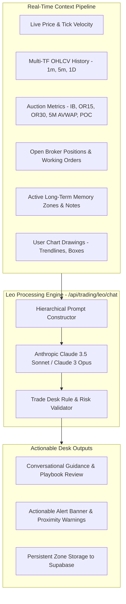

# Leo AI Assistant, Long-Term Memory & Web Audio Alerts

> **TradePulse Intelligence & Audio Alerting Infrastructure**  
> **AI Copilot**: Leo — Multi-Tier Contextual Trading Assistant  
> **Memory Architecture**: Persistent Higher-Timeframe Long-Term Memory (LTM) Zones  
> **Sound Engine**: Web Audio API Procedural Two-Tone Chime Synthesis (Zero MP3 Assets)  

---

## 1. Leo AI Assistant Architecture

Leo is TradePulse's native AI trading copilot and risk advisor. Unlike generic chatbots, Leo operates with continuous access to live chart state, market structure, open broker positions, and user-defined memory zones.


```mermaid
graph TD
    subgraph Context_Ingestion [Real-Time Context Pipeline]
        LIVE_PRICE[Live Price & Tick Velocity]
        CANDLES[Multi-TF OHLCV History - 1m, 5m, 1D]
        AUCTION[Auction Metrics - IB, OR15, OR30, 5M AVWAP, POC]
        POSITIONS[Open Broker Positions & Working Orders]
        MEMORIES[Active Long-Term Memory Zones & Notes]
        DRAWINGS[User Chart Drawings - Trendlines, Boxes]
    end

    subgraph Leo_Core [Leo Processing Engine - /api/trading/leo/chat]
        PROMPT_BUILDER[Hierarchical Prompt Constructor]
        LLM[Anthropic Claude 3.5 Sonnet / Claude 3 Opus]
        SANITY_FILTER[Trade Desk Rule & Risk Validator]
    end

    subgraph Outputs [Actionable Desk Outputs]
        CHAT_RESP[Conversational Guidance & Playbook Review]
        ALERT_ACTION[Actionable Alert Banner & Proximity Warnings]
        MEM_SYNC[Persistent Zone Storage to Supabase]
    end

    Context_Ingestion --> PROMPT_BUILDER
    PROMPT_BUILDER --> LLM
    LLM --> SANITY_FILTER
    SANITY_FILTER --> Outputs
```

### 1.1 Hierarchical Prompt System & The 22-Rule Wyckoff Directive
Leo's system prompt (`lib/ai/leoAssistant.ts`) enforces strict institutional trading desk principles:
- **Authoritative 22-Rule Wyckoff Directive (Absolute Directive)**: Evaluates setups strictly according to the **22-Rule Wyckoff Playbook**. Leo enforces the 4 valid execution triggers (Spring Reclaim LONG, Breakdown Failed Reclaim SHORT, Upthrust Return Below SHORT, Breakout Retest LONG) and discards all random trading ranges away from predetermined levels.
- **Pre-Market Frozen Tier-1 Map (Rule 3)**: Recognizes pre-market structural zones (5D Profile, Yesterday Profile, Overnight) as permanently frozen at 09:30 ET cash open. Rejects dynamically invented levels mid-session.
- **Volume & CVD Effort vs. Result (Rules 12 & 13)**: Evaluates whether aggressive order flow is achieving expected price progress or being absorbed by passive liquidity at key boundaries.
- **Strict $\ge 2.0\text{R}$ Reward-to-Risk Requirement (Rule 17)**: Requires verified distance to the next major opposing Tier-1 zone before validating any trade setup.
- **Structural Invalidation Stops (Rule 18 & 19)**: Enforces stops strictly beyond the Spring low or Upthrust high. Emphasizes that invalidation is final and stops must never be widened.
- **Zero-Hallucination Mandate**: Leo is strictly forbidden from fabricating price levels, VWAP numbers, or order states. Every numerical value cited must derive from verified live telemetry.

### 1.2 Dedicated `📜 Wyckoff 22 Rules` Interactive Panel (`WyckoffRulesPanel.tsx`)
Embedded inside the Leo Assistant drawer, the **Wyckoff 22 Rules Panel** provides immediate visual reference and quick-audit capabilities:
- **Header Banner**: Dynamic asset indicator showing current active instrument (`NQ`, `ES`, `YM`, `Gold`, `Oil`).
- **1-Click Audit Buttons**:
  - `🎯 Audit 4 Setups on [Instrument]`: Asks Leo to audit Spring, Upthrust, Breakout Retest, and Breakdown Retest against live price.
  - `🗺️ Check Frozen Tier 1 Map`: Asks Leo to verify which pre-marked Tier 1 zone price is currently approaching.
  - `📊 Audit CVD Effort vs Result`: Asks Leo to analyze aggressive order flow absorption at key levels.
- **The ONLY 4 Trades Cards**: Color-coded breakdown of the 4 valid execution setups with exact entry triggers, stop placement, and CVD criteria.
- **Final Chart Hierarchy**: Visual breakdown of Tier 1 (Mandatory), Tier 2 (Confirmation), and Tier 3 (Context Only).
- **The 8-Step Screen-Reading Sequence**: Step-by-step checklist from Location to Entry.
- **Absolute Filters (When NOT to Trade)**: 8 non-negotiable conditions for standing aside.

---

## 2. Long-Term Memory (LTM) Architecture

Traders frequently identify critical weekly, monthly, or daily inflection zones that must remain remembered for days or weeks.

```
┌────────────────────────────────────────────────────────┐
│  🧠 LEO MEMORY: Major Weekly Absorption [🔔 ALARM ON]  │
├────────────────────────────────────────────────────────┤
│  Price High: 44,850.00                                 │
│  Price Low:  44,720.00                                 │
│  Notes: Watch for buyer absorption; break targets POC. │
└────────────────────────────────────────────────────────┘
```

### 2.1 Memory Zone Structure (`lib/trading/leoLongTermMemory.ts`)
Each memory zone stores:
- `id`: Unique identifier.
- `instrument`: Associated asset (`DOW`, `NASDAQ`, `ES`, `GOLD`, `CRUDE`).
- `priceHigh` & `priceLow`: Zone boundaries.
- `purpose`: High-level tactical description (e.g. "Weekly Absorption Zone").
- `notes`: Detailed trader notes and game plan.
- `alarmEnabled`: Boolean flag triggering audio chimes upon visit.
- `lastAlertAt`: Timestamp of the last alert (enforces a 90-second debounce cooldown).

### 2.2 1-Click Zone Creation
- When the trader draws a **Range Box** on the chart, the drawing toolbar displays a `🧠 Activate Long-Term Memory` button.
- Clicking this instantly attaches memory metadata, prompts for tactical notes, activates the audio alarm, and persists the zone to Supabase and browser cache.

---

## 3. Real-Time Proximity Scanner & Web Audio Chime Synthesis

### 3.1 Proximity Scanner Logic
Every incoming price tick is evaluated against active memory zones:
1. Checks if `price >= memory.priceLow && price <= memory.priceHigh`.
2. Verifies that `memory.alarmEnabled === true`.
3. Checks that `Date.now() - memory.lastAlertAt > 90,000ms` (cooldown guard).
4. If triggered:
   - Sets `memory.lastAlertAt = Date.now()`.
   - Triggers the Web Audio synthesizer.
   - Pushes an actionable alert banner to the HUD and Dashboard Notifications center.

### 3.2 Web Audio API Procedural Synthesizer (`lib/chart/soundEffects.ts`)
Rather than relying on external MP3/WAV files (which suffer from browser caching issues, network latency, and autoplay blocking), TradePulse generates an authentic **TradingView-style dual-tone chime** directly in memory using the Web Audio API (`AudioContext`):

```typescript
export function playTradingViewChime(): void {
  const ctx = getAudioContext()
  const now = ctx.currentTime

  // Tone 1: Fundamental A5 (880 Hz)
  const osc1 = ctx.createOscillator()
  const gain1 = ctx.createGain()
  osc1.type = 'sine'
  osc1.frequency.setValueAtTime(880, now)
  gain1.gain.setValueAtTime(0.28, now)
  gain1.gain.exponentialRampToValueAtTime(0.001, now + 0.38)
  osc1.connect(gain1); gain1.connect(ctx.destination)
  osc1.start(now); osc1.stop(now + 0.40)

  // Tone 2: Harmonic E6 (1318.51 Hz) + Upper Shimmer (1760 Hz)
  const osc2 = ctx.createOscillator()
  const gain2 = ctx.createGain()
  osc2.type = 'sine'
  osc2.frequency.setValueAtTime(1318.51, now + 0.12)
  gain2.gain.setValueAtTime(0.32, now + 0.12)
  gain2.gain.exponentialRampToValueAtTime(0.001, now + 0.58)
  osc2.connect(gain2); gain2.connect(ctx.destination)
  osc2.start(now + 0.12); osc2.stop(now + 0.60)
}
```

- **Acoustic Characteristics**: Two pure sinusoidal tones spaced by a perfect fifth (A5 -> E6), producing the crisp, pleasant, and instantly recognizable TradingView alert chime.
- **Latency**: Sub-millisecond instantaneous trigger.
- **Zero Assets**: Operates completely offline with 0KB of downloaded audio assets.

---

## 4. Notifications Center & In-Chart Banners

- **Floating Alert Banners**: When price breaches a memory zone, a high-contrast toast banner appears at the top of the chart with an `Ask Leo` quick-action button, instantly populating Leo's chat with the memory context.
- **Dashboard Notifications Center (`DashboardNotifications.tsx`)**: An embedded live feed on the dashboard home page logging all recent breach events, chime test triggers, and active memory zone management.

---

## 5. Session Playbook Lifecycle Window (09:15 AM EDT Cutoff)

Trading desks prepare and debate playbooks during pre-market liquidity formation. Once the New York cash open approaches, institutional participant flows shift drastically:

- **Pre-Market Viability Window (00:00 - 09:15 AM EDT)**:
  - The `Discuss Playbook` trigger is actively available.
  - Traders review overnight inventory, Initial Balance projections, Tier-1 frozen levels, and institutional setups with Leo.
- **09:15 AM Cutoff (`isPlaybookDiscussionEligible()`)**:
  - Exactly at 09:15 AM EDT (15 minutes prior to cash equity open at 09:30 AM), pre-market playbook discussions are **locked**.
  - **Rationale**: Cash open institutional order flows override overnight models. Attempting to trade static pre-market theses into high-velocity open imbalances without live reaction validation leads to adverse selection.
  - **Dynamic Desk Transition**: The UI displays a live countdown timer until 09:15 AM. Once passed, the prompt badge transitions to `🔒 Locked (09:15 AM Cutoff Passed - Live Reaction Mode Active)`.

---

## 6. The Interactive `📜 Wyckoff 22 Rules` Panel & Purge of AI Stacked Hedging

The speculative multi-agent AI Stack (Aegis hedging specialist, dealer gamma flip levels, CTA liquidation trigger bands) has been **completely purged** from the platform.

In its place, the Leo Assistant drawer integrates the dedicated **`📜 Wyckoff 22 Rules`** interactive panel ([`WyckoffRulesPanel.tsx`](file:///c:/Users/shahb/myApplications/Trading/app/dashboard/chart/components/WyckoffRulesPanel.tsx)):

```
┌────────────────────────────────────────────────────────────────────────┐
│  📜 THE TRADER'S 22-RULE WYCKOFF & AUCTION MARKET PLAYBOOK             │
├────────────────────────────────────────────────────────────────────────┤
│  • Support: Spring ➔ Reclaim ➔ LONG (Stop below spring low)            │
│  • Support: Breakdown ➔ Failed Reclaim ➔ SHORT (Stop above failed)     │
│  • Resistance: Upthrust ➔ Return Below ➔ SHORT (Stop above upthrust)   │
│  • Resistance: Breakout ➔ Retest (SOS ➔ LPS / SOW ➔ LPSY) ➔ LONG       │
├────────────────────────────────────────────────────────────────────────┤
│  Quick Actions:                                                        │
│  [🏛️ Audit 4 Setups] [⚡ Audit Order Flow] [📈 Compare Range Volume]    │
└────────────────────────────────────────────────────────────────────────┘
```

- **4 Valid Trade Setup Cards**: Interactive breakdown of Spring Reclaim, Breakdown Failed Reclaim, Upthrust Return Below, and Breakout Retest.
- **3-Tier Hierarchy & 8-Step Checklist**: Visual reference for Tier 1 frozen levels (09:30 ET map), Tier 2 Volume/CVD confirmation, and Tier 3 context (5M AVWAP).
- **One-Click Audit Integration**: Directly triggers Leo to audit setup validity, inspect CVD absorption, or confirm minimum 2R distance to opposing zones.

---

## 7. Order Execution & Desk Safety Invariants

### 7.1 AI Never Auto-Exits Positions (Zero Autonomous Closes)
> [!IMPORTANT]
> **Desk Invariant**: Under no circumstance does Leo AI automatically close, exit, or flatten an active broker position. Only the human trader possesses authorization to liquidate or exit positions.

- **Advisory Directives**: If Leo generates a `CLOSE_POSITION` directive or if a **Stagnation Timeout** is reached (e.g. 5 minutes without moving into profit), the system **blocks automated order dispatch**.
- **Actionable Advisory Prompt**: Instead, Leo plays an audio advisory chime, synthesizes speech (`"Leo recommends closing position: reason"`), and posts an advisory card with an explicit warning:
  `⚠️ [LEO EXIT ADVISORY - MANUAL ACTION REQUIRED] Please execute manual exit on your chart toolbar if desired.`

### 7.2 Defensive Bracket, Directive Sanitization & Instrument Base Prices
When Leo drafts entry orders (`PLACE_ORDER` / `OPEN_POSITION` / `ARM_CONDITIONAL_ENTRY`), the execution layer enforces strict mathematical boundary validation:
1. **Instrument-Aware Base Prices**: Fallbacks query exact canonical 2026 CME market levels rather than outdated static prices:
   - **DOW**: Base `52,500.00` | SL `60 pts` | TP `120 pts`
   - **NASDAQ**: Base `29,500.00` | SL `25 pts` | TP `50 pts`
   - **ES (S&P 500)**: Base `6,000.00` | SL `10.0 pts` | TP `20.0 pts`
   - **GOLD**: Base `4,350.00` | SL `5.0 pts` | TP `10.0 pts`
   - **CRUDE**: Base `104.00` | SL `0.50 pts` | TP `1.00 pt`
   - **SILVER**: Base `32.000` | SL `0.250 pts` | TP `0.500 pts`
2. **Directive Type Sanitization**: `parseLeoDirectives` cleanly casts stringified LLM outputs into finite numbers and strips trailing commas before JSON parsing.
3. **Safe Notification Formatting**: Notification routes format `priceDisplay` defensively to prevent unhandled `TypeError` exceptions on undefined/null prices.
4. **Bracket Sanity**:
   - **LONG**: Validates `stopLoss < entryPrice` and `profitTarget > entryPrice`. If inverted, snaps stop loss to `entryPrice - slDist` and target to `entryPrice + tpDist`.
   - **SHORT**: Validates `stopLoss > entryPrice` and `profitTarget < entryPrice`. If inverted, snaps stop loss to `entryPrice + slDist` and target to `entryPrice - tpDist`.
5. **Personal Futures Risk Budgeting**: Sized strictly according to the account's $500 Daily Loss Limit ($50 risk per trade). The desk strictly operates in read-only mode (zero order execution).

---

## 8. High-Frequency Memory Crossing & Gap-Through Engine

When price moves rapidly during the New York or London open, ticks can skip discrete price levels between consecutive updates.

### 8.1 Adaptive Crossing Algorithm (`lib/trading/leoLongTermMemory.ts`)
The proximity evaluation engine does not rely solely on static inside-bounds testing:
```typescript
// 1. Adaptive tolerance based on zone width
const span = high - low
const tol = Math.max(1.0, span * 0.05)
const isInside = currentPrice >= (low - tol) && currentPrice <= (high + tol)

// 2. High-speed crossing & gap jump detection
const isCrossing = previousPrice != null && (
  (previousPrice < low && currentPrice > high) ||
  (previousPrice > high && currentPrice < low)
)

if (isInside || isCrossing) {
  // Trigger alarm chime and dispatch alert
}
```
- Tracks `previousPrice` across 250ms tick updates.
- If price jumps from 29,000 to 29,050 over an institutional memory zone at 29,025, `isCrossing` evaluates to `true`, ensuring zero missed triggers during opening breakouts.

---

## 9. Interactive Multiline Chat Interface

The trader input in `LeoAssistantPanel.tsx` is engineered for rapid keyboard workflows:
- **Auto-Expanding Multiline Textarea**: Expands dynamically up to 160px as the trader inputs complex game plans and multi-line theses.
- **Keybindings**:
  - `Enter`: Submits message immediately.
  - `Shift + Enter`: Inserts a clean newline without submitting.
- **Voice-to-Text Support**: Includes Web Speech Recognition integration for hands-free audio dictation during fast-moving trading sessions.

---

## 10. Market Situations & Armed Entry Rules Engine

The **Market Situations & Leo Rules** engine (`lib/trading/leoRules.ts` & `/app/dashboard/situations/page.tsx`) acts as the central command center for all conditional market strategies, desk alarms, level monitors, and stagnation rules armed by Leo or the trader.

### 10.1 Rule Architecture & Dated Metadata (`lib/trading/leoRules.ts`)
Every armed rule carries full timestamping, session provenance, and structured condition tiers:

```typescript
export interface ArmedRule {
  id: string
  instrument: 'DOW' | 'NASDAQ' | 'ES' | 'GOLD' | 'CRUDE'
  type: 'CONDITIONAL_ENTRY' | 'STAGNATION_TIMEOUT' | 'DESK_ALERT' | 'TELEGRAM_ALERT'
  status: 'ARMED' | 'TRIGGERED' | 'EXECUTED' | 'SATISFIED' | 'CANCELLED' | 'EXPIRED'
  createdDateFormatted: string  // e.g. "Sep 15, 2026 • 21:04 EDT"
  sessionDate: string          // YYYY-MM-DD
  sessionTime: string          // HH:mm EDT
  conditions: {
    targetReference?: string
    targetPrice?: number
    direction?: 'LONG' | 'SHORT'
    pattern?: PricePattern      // 'BULLISH_ENGULFING' | 'BEARISH_ENGULFING' | 'HAMMER' | ... | 'LEVEL_TOUCH'
    entryTimeframe?: string | null // e.g. '5', '15', '30'. null = Any TF (Leo monitors all)
    cvdDivergence?: boolean    // Requires order flow CVD divergence at level
    stopLossMode?: string
    takeProfitMode?: string
    rewardToRiskRatio?: number // Auto-calculated (e.g. 2.0)
    size?: number
    isLongTerm?: boolean
    maxMinutes?: number
  }
  userPrompt?: string
  description: string
}
```

### 10.2 Pattern Defaulting Logic (`LEVEL_TOUCH`)
> [!IMPORTANT]
> **No Auto-Assigned Patterns**: When the trader gives a level command without explicitly stating a candlestick pattern (e.g., *"If price goes above 52,800, buy"*), Leo sets `pattern = 'LEVEL_TOUCH'` (Price Touch at Level).
> 
> - **Level Touch**: Fires purely on price reaching the defined target level, requiring **no specific candlestick pattern**. Rendered in UI cards as **`📍 Entry: Price Touch`**.
> - **Explicit Patterns**: If the prompt explicitly mentions candlestick patterns (*"bullish engulfing"*, *"hammer"*, *"rejection tail"*), Leo sets the pattern accordingly (`⚡ Pattern: BULLISH ENGULFING`).

### 10.3 Dynamic Timeframe & CVD Divergence Rules
1. **Timeframe Flexibility (`entryTimeframe`)**:
   - **User Specified**: If the prompt contains a timeframe (e.g., *"on the 5m chart"*), `entryTimeframe = '5'`.
   - **Unspecified**: Defaults to `null` (**`⏱️ TF: Any TF — Leo monitors all`**), instructing Leo to evaluate incoming ticks across all active chart timeframes.
2. **CVD Divergence Requirement (`cvdDivergence`)**:
   - Spoken phrases like *"if CVD divergence at the level"* flag `cvdDivergence = true`.
   - Displayed on situation cards as **`📊 CVD: ✅ Divergence Required`**.

---

## 11. Leo Questioning Engine, System Prompt Section 5f & Telemetry Integration

Leo integrates the **Auction Price Critique & Questioning Protocol** into its core prompt engineering and context processing pipeline (`lib/ai/leoAssistant.ts` & `/api/trading/leo/chat`):

### 11.1 System Prompt Section 5f: AUCTION PRICE CRITIQUE & "QUESTIONING" DESK PROTOCOL
- **Auction Mindset**: Instructs Leo to treat the market as a place to conduct business only at advantageous wholesale prices. If price is not suitable, Leo preaches patience: *"We do not force a trade. Be patient."*
- **Aggressive Price Critique**: Commands Leo to challenge the trader whenever they attempt to chase a single green/red candle or buy into expensive overnight retail inventory: *"Why the hell should we buy here at 9:30 AM when Asian & London participants bought 30 points lower?"*
- **6-Point Pre-Trade Self-Audit Checklist**: Leo incorporates Q1 Impulse Trap, Q2 Psychological Magnet, Q3 Liquidity Vacuum, Q4 Time Regulation, Q5 Global Inventory, and Q6 Wholesale vs Retail Valuation into every trade evaluation.

---

## 12. Leo Desk Assistant Quick Action Suggestion Chips & Relocated HUD Controls

### 12.1 Synchronized Quick Action Chips inside Leo Drawer
All major quick analysis actions inside `LeoAssistantPanel.tsx` are aligned with the 22-Rule Wyckoff Strategy:
- **`🏛️ Audit 4 Setups`**: Requests Leo to audit the 4 valid trade setups (Spring Reclaim, Breakdown Failed Reclaim, Upthrust Return Below, Breakout Retest) on the current instrument.
- **`⚡ Audit Order Flow`**: Triggers immediate cumulative volume delta (CVD) vs VWAP absorption/divergence audit.
- **`📈 Compare Range Volumes`**: Compares traded volume and S/R quality across active user-drawn range boxes.
- **`📊 Dalton Day Type`**: Summarizes 30-minute TPO period expansion, session auction tails, and Dalton day type.

### 12.2 Relocated Chart HUD Top Bar Action Links
Quick-action buttons are directly accessible on the top chart HUD strip:
- **Dalton Day Type**: `Day: {badgeText} [🤖 Ask Leo]` (or `Day: Pre-Session [🤖 Ask Leo]` in Globex).
- **Audit Order Flow**: `[🤖 Audit Order Flow]` button placed next to `CVD: ON/OFF`.
- **5-Month Macro AVWAP**: `[🟢 5M AVWAP: <price> 5 MO]` button placed directly next to `CVD: ON/OFF`. Keeps chart canvas invisible by default while providing 1-click access to the 5-Month Benchmark Inspection Modal.
- **Compare Range Volume**: `[📈 Compare Range Volume]` button on the top HUD.
- **Auction Price Critique**: `[⚖️ Critique: STANDBY/DISCOUNT/PREMIUM]` button (Hotkey: `Q`).

---

## 13. Market Closed Session Day Type Protocol & Settlement Lock

### 13.1 Post-Market Settlement Lock
During regular trading hours (09:30–16:00 ET), Dalton Day Type classification updates dynamically with 30-minute TPO period expansion. When the NYC cash session closes (post-16:00 ET), the system automatically locks the day type state:
- **Settled Telemetry (`TradingChart.tsx`)**: Sends `${dayTypeEval.badgeText} (FINAL / SESSION CLOSED)` to Leo rather than resetting `dayType` to `null`.
- **Header HUD Readout**: Displays **`Day: [DAY_TYPE] (Closed)`** with 1-click Ask Leo summary integration.

### 13.2 Anti-Hallucination Prompt Policy
Leo's system prompt (`lib/ai/leoAssistant.ts`) enforces the **Market Closed Session Rule**:
- When the session is tagged as `FINAL / SESSION CLOSED`, Leo is strictly forbidden from stating that the day type is "forming", "waiting", or "in progress".
- Leo authoritatively reports the exact settled day type (e.g. *"Today's session closed as a completed Bullish Trend Day..."*) and details the final auction structure.
