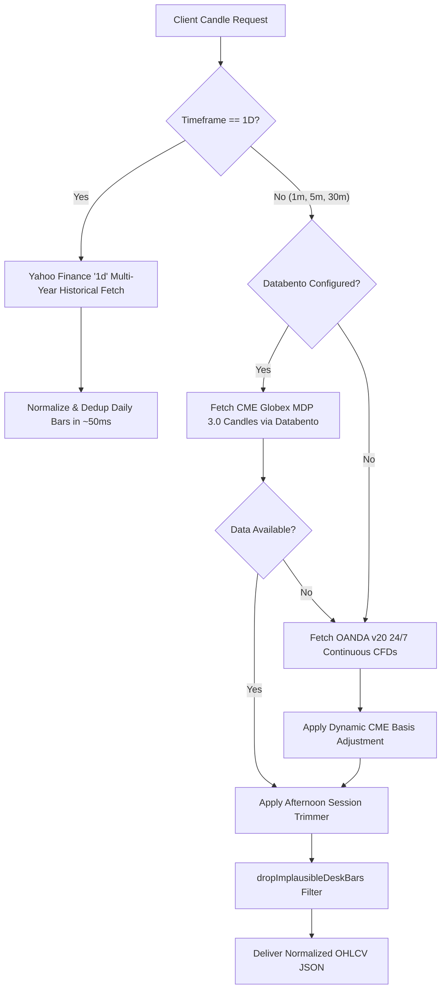

# Market Data Pipelines & Settlement Alignment Guide

> **TradePulse Market Data Infrastructure**  
> **Feeds**: CME Globex MDP 3.0 (Databento) · OANDA v20 24/7 CFDs · Yahoo Finance Daily Macro  
> **Basis Alignment**: Continuous Dynamic Futures-Spot Offset  
> **Data Normalization**: Strict Monotonic Deduplication & Montreal Wall Clock Shifting  

---

## 1. Supported Instruments & Contract Specifications

TradePulse actively monitors and charts institutional futures instruments and CFD mirrors across four core active trading desk markets:

| Display Name | Internal Symbol | Primary CME Contract | CME Tick Size | Point Value | Typical CME Basis (Offset) | 2026 Base Price Level |
| :--- | :--- | :--- | :--- | :--- | :--- | :--- |
| **DOW** | `DOW` | `MYM` / `YM` (E-mini/Micro Dow) | 1.0 pt | $0.50 / pt (Micro) | ~60.5 pts | ~52,500.00 |
| **NASDAQ** | `NASDAQ` | `MNQ` / `NQ` (E-mini/Micro Nasdaq) | 0.25 pt | $2.00 / pt (Micro) | ~36.5 pts | ~29,500.00 |
| **GOLD** | `GOLD` | `MGC` / `GC` (Micro/E-mini Gold) | 0.10 pt | $10.00 / pt (Micro) | ~48.0 pts | ~4,350.00 |
| **CRUDE** | `CRUDE` | `CL` / `MCL` (Crude Oil) | 0.01 pt | $10.00 / pt (Micro) | 0.00 pts | ~104.00 |

*(Note: Nikkei 225 `NKD` is retired from the active trading desk and economic calendar feeds to focus exclusively on US Indices, Gold, and Oil).*

---

## 2. Multi-Tiered Market Data Fallback Hierarchy

To maintain continuous 24/7 charting resilience and sub-second response times without broker lock-in, TradePulse employs a tiered query resolution engine (`app/api/trading/candles/route.ts`):



### 2.1 Tier 1: CME Globex MDP 3.0 via Databento Live Hub
- Configured via `DATABENTO_API_KEY` and the Databento Live Gateway Sidecar (`scripts/databento_live_sidecar.py`).
- Directly streams raw CME Globex exchange trade ticks from the Aurora colocation center (`GLBX.MDP3`).
- Both Server-Sent Events (`/api/trading/quote/stream`) and REST polls (`/api/trading/quote`) query `getLatestDatabentoLiveQuote` to deliver zero-latency price updates across `DOW`, `NASDAQ`, `GOLD`, and `CRUDE`.

### 2.2 Tier 2: OANDA v20 Continuous CFDs with CME Basis
- When Databento is offline, throttled, or for extended 24-hour overnight coverage, OANDA continuous CFD pricing (`US30_USD`, `NAS100_USD`, `XAU_USD`, `WTICO_USD`) is fetched.
- **CME Basis Engine (`lib/trading/cmeBasis.ts`)**:
  - CFDs trade against spot indices rather than futures contracts.
  - TradePulse dynamically calculates the spot-futures difference:
    $$\text{Basis} = \text{Price}_{\text{CME Futures}} - \text{Price}_{\text{OANDA Spot}}$$
  - The basis offset is periodically updated (`CME_BASIS_REFRESH_MS = 60,000ms`) and applied to every OANDA bar:
    $$\text{Price}_{\text{Adjusted}} = \text{Price}_{\text{OANDA}} + \text{Basis}$$
  - Ensures that prices charted on the desk match the trader's Tradovate, NinjaTrader, or TopstepX futures execution platform to the exact tick.

### 2.3 Tier 3: Yahoo Finance Daily Macro History (`1D`)
- For multi-year Higher Timeframe context on the Daily (`1D`) chart, requests bypass high-volume 1-minute historical servers (which would require downloading 260,000 bars) and query Yahoo Finance directly.
- Returns ~500 to 730 clean, consolidated daily bars spanning 2 full calendar years in under 50 milliseconds.

### 2.4 Economic Calendar: ForexFactory Fallback Feed
- To bypass free-tier API restrictions (`HTTP 403 Forbidden` on `/calendar/economic`), `finnhubClient.ts` automatically queries the live ForexFactory Weekly Calendar JSON feed (`https://nfs.faireconomy.media/ff_calendar_thisweek.json`).
- Automatically maps high-impact macroeconomic events (FOMC, CPI, NFP, Crude Inventories) to active trader instruments: `DOW`, `NASDAQ`, `GOLD`, and `CRUDE`.

---

## 3. Normalization, Deduplication & Forming Bar Architecture

### 3.1 Strict Monotonic Deduplication (`normalizeCandleTimes`)
Lightweight Charts requires strictly ascending Unix timestamps. Duplicate or out-of-order bars cause runtime exceptions and freeze rendering loops.
- `normalizeCandleTimes` performs:
  1. Ascending numerical sort by Unix epoch timestamp.
  2. Removal of consecutive duplicates (`prev.time === cur.time`), preserving the most recently updated quote.
  3. High/Low sanity enforcement: $\text{High} = \max(O, H, L, C)$, $\text{Low} = \min(O, H, L, C)$.

### 3.2 Implausible Spike Detection (`dropImplausibleDeskBars`)
- Filters corrupted quotes, bad broker prints, or off-market price spikes that exceed $15\%$ deviations from the rolling moving median.

### 3.3 Wall Clock Time Shifting (`toChartTime`)
- The trader's workstation operates in **Montreal Civil Time (America/Toronto EDT / UTC-4)**.
- Incoming UTC epoch timestamps are shifted using `toChartTime`:
  ```typescript
  export function toChartTime(unixSec: number, timeZone: string): number {
    const p = wallParts(unixSec, timeZone)
    return Math.floor(Date.UTC(p.y, p.mo - 1, p.d, p.h, p.mi, p.s) / 1000)
  }
  ```
- This ensures that when the chart renders tick marks, the bottom axis displays actual desk session hours (e.g. `09:30 EDT` cash open) rather than UTC midnight offsets.
- On Daily charts (`1D`), time display is bypassed (`timeVisible: false`), and formatters output clean calendar dates (`Sep 14, 2026`).

### 3.4 Live Forming Bar Merging
- When real-time price ticks arrive via SSE `/api/trading/quote/stream`:
  - If the tick falls within the active candle's time bucket:
    $$\text{High} = \max(\text{High}_{\text{bar}}, \text{Price}_{\text{live}})$$
    $$\text{Low} = \min(\text{Low}_{\text{bar}}, \text{Price}_{\text{live}})$$
    $$\text{Close} = \text{Price}_{\text{live}}$$
    $$\text{Volume} = \text{Volume}_{\text{bar}} + \text{Volume}_{\text{tick}}$$
  - The series is updated imperatively via `candleRef.current.update()`, guaranteeing zero lag and zero chart flickering.

---

## 4. Understanding Fast Market Move Gaps (London & NYC Open)

During high-volatility events (e.g. 03:00 EDT London Open, 09:30 EDT New York Cash Open, or 08:30 EDT CPI releases), traders may observe candle opening gaps or discrete visual jumps on 1-minute or 5-minute charts.

### 4.1 Databento Historical API vs. Live Stream
- In the current configuration, Databento queries hit `https://hist.databento.com/v0/timeseries.get_range?dataset=GLBX.MDP3`.
- `hist.databento.com` is Databento's **Historical HTTP Batch API**, used for seeding past bars upon chart initialization.
- It is **not** Databento's Live WebSocket / TCP binary gateway (`live.databento.com`).

### 4.2 Live Price Pipeline Sampling (OANDA + Basis SSE)
- Live price updates are pushed down via Server-Sent Events (`/api/trading/quote/stream`) backed by OANDA CFD ticks adjusted for CME Basis.
- While CFD pricing is fast, browser SSE connections receive aggregated updates at ~250ms to 1000ms intervals.
- When an aggressive institutional order sweeps 40 points in 100 milliseconds:
  - Quotes skip intermediate price increments.
  - The client's active candle engine receives the post-sweep quote directly.

### 4.3 Lightweight Charts Candle Synthesis
- If a market surge occurs exactly at the boundary between minute bars (e.g. 09:30:00 vs 09:30:01):
  - The prior bar closes at the last known quote before 09:30:00 (e.g. 21,500.00).
  - The first quote received in the new bucket arrives at 09:30:00.600 at 21,525.00.
  - The charting engine sets $\text{Open}_{new} = 21,525.00$.
  - Lightweight Charts renders a visual 25-point gap between the bars.
- Additionally, true CME Globex order books frequently skip price levels during liquidity voids, printing real exchange-side price gaps between consecutive transactions.

---

## 5. Databento Live CME Globex Exchange Gateway (TCP / DBN)

To access true sub-millisecond CME Globex exchange trades directly from the CME Aurora colocation center without third-party broker translation, TradePulse implements a local **Databento Live Gateway Sidecar** (`scripts/databento_live_sidecar.py`).

### 5.1 Architecture & Gateway Connectivity
```mermaid
graph LR
    CME[CME Aurora Globex MDP 3.0] -->|DBN Binary Protocol| DB_TCP[Databento Live TCP Gateway]
    DB_TCP -->|Raw TCP Socket| SIDECAR[scripts/databento_live_sidecar.py]
    SIDECAR -->|Local SSE 127.0.0.1:8765/stream| HUB[lib/databento/liveHub.ts]
    HUB -->|Server-Sent Events /api/trading/quote/stream| CLIENT[Lightweight Charts UI]
    HUB -->|Live 1m Forming Candles| CANDLES[/api/trading/candles]
```

### 5.2 Supported Live CME Continuous Symbols
| Market | Continuous Symbol | Primary Underlying | Schema | Sidecar Port |
| :--- | :--- | :--- | :--- | :--- |
| **NASDAQ** | `MNQ.c.0` | Micro E-mini Nasdaq-100 Futures | `trades` | `127.0.0.1:8765` |
| **DOW** | `MYM.c.0` | Micro E-mini Dow Futures | `trades` | `127.0.0.1:8765` |
| **GOLD** | `MGC.c.0` | Micro Gold Futures | `trades` | `127.0.0.1:8765` |
| **CRUDE** | `CL.c.0` | Light Sweet Crude Oil Futures | `trades` | `127.0.0.1:8765` |
| **NIKKEI** | `NKD.c.0` | Nikkei 225 Dollar Futures | `trades` | `127.0.0.1:8765` |

### 5.3 Operation & Auto-Spawning
- **Automatic Lifecycle**: The Node.js hub (`lib/databento/liveHub.ts`) checks the sidecar health on startup. If the sidecar is not already running and `DATABENTO_API_KEY` is present, it automatically spawns the Python sidecar daemon in the background.
- **Manual Launch**: The sidecar can also be run directly from the command line:
  ```bash
  npm run databento:live
  ```
- **Live Feed Tiering & Failover**:
  1. **Tier 1 (Databento Live)**: When the sidecar is active, real exchange trades stream with zero basis adjustment (`source: 'cme'`).
  2. **Tier 2 (OANDA + Basis)**: If the sidecar is offline or disconnected, OANDA continuous CFDs seamlessly maintain the live price stream without interruption.


