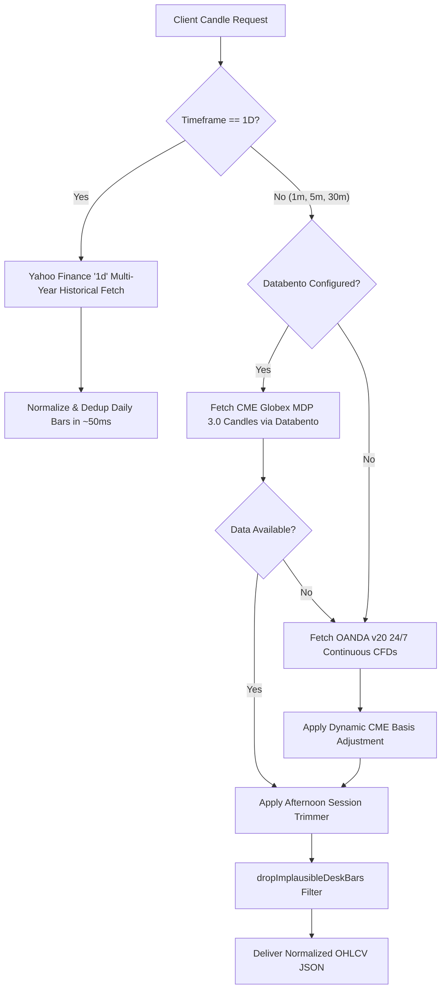

# Market Data Pipelines & Settlement Alignment Guide

> **TradePulse Market Data Infrastructure**  
> **Feeds**: CME Globex MDP 3.0 (Databento) · OANDA v20 24/7 CFDs · Yahoo Finance Daily Macro  
> **Basis Alignment**: Continuous Dynamic Futures-Spot Offset  
> **Data Normalization**: Strict Monotonic Deduplication & Montreal Wall Clock Shifting  

---

## 1. Supported Instruments & Contract Specifications

TradePulse actively monitors and charts institutional futures instruments and CFD mirrors:

| Display Name | Internal Symbol | Primary CME Contract | CME Tick Size | Point Value | Typical CME Basis (Offset) |
| :--- | :--- | :--- | :--- | :--- | :--- |
| **DOW** | `DOW` | `MYM` / `YM` (E-mini/Micro Dow) | 1.0 pt | $0.50 / pt (Micro) | ~60.5 pts |
| **NASDAQ** | `NASDAQ` | `MNQ` / `NQ` (E-mini/Micro Nasdaq) | 0.25 pt | $2.00 / pt (Micro) | ~36.5 pts |
| **GOLD** | `GOLD` | `MGC` / `GC` (Micro/E-mini Gold) | 0.10 pt | $10.00 / pt (Micro) | ~48.0 pts |
| **CRUDE** | `CRUDE` | `CL` / `MCL` (Crude Oil) | 0.01 pt | $10.00 / pt (Micro) | 0.00 pts |
| **NIKKEI** | `NIKKEI` | `NKD` (Nikkei 225 Dollar-Denom) | 5.0 pts | $5.00 / pt | 0.0 pts |

---

## 2. Multi-Tiered Market Data Fallback Hierarchy

To maintain continuous 24/7 charting resilience and sub-second response times without broker lock-in, TradePulse employs a tiered query resolution engine (`app/api/trading/candles/route.ts`):



### 2.1 Tier 1: CME Globex MDP 3.0 via Databento
- Configured via `DATABENTO_API_KEY`.
- Directly streams raw exchange packets from the CME Aurora colocation center (`GLBX.MDP3`).
- Highest precision order-flow and level-matched volume data for intraday timeframes (`1m`, `5m`).

### 2.2 Tier 2: OANDA v20 Continuous CFDs with CME Basis
- When Databento is offline, throttled, or for extended 24-hour overnight coverage, OANDA continuous CFD pricing (`US30_USD`, `NAS100_USD`, `XAU_USD`, `WTICO_USD`) is fetched.
- **CME Basis Engine (`lib/trading/cmeBasis.ts`)**:
  - CFDs trade against spot indices rather than futures contracts.
  - TradePulse dynamically calculates the spot-futures difference:
    $$\text{Basis} = \text{Price}_{\text{CME Futures}} - \text{Price}_{\text{OANDA Spot}}$$
  - The basis offset is periodically updated (`CME_BASIS_REFRESH_MS = 60,000ms`) and applied to every OANDA bar:
    $$\text{Price}_{\text{Adjusted}} = \text{Price}_{\text{OANDA}} + \text{Basis}$$
  - Ensures that prices charted on the desk match the trader's Tradovate, NinjaTrader, or TopstepX futures execution platform to the exact tick.

### 2.3 Tier 3: Yahoo Finance Daily Macro History (`1D`)
- For multi-year Higher Timeframe context on the Daily (`1D`) chart, requests bypass high-volume 1-minute historical servers (which would require downloading 260,000 bars) and query Yahoo Finance directly.
- Returns ~500 to 730 clean, consolidated daily bars spanning 2 full calendar years in under 50 milliseconds.

---

## 3. Normalization, Deduplication & Forming Bar Architecture

### 3.1 Strict Monotonic Deduplication (`normalizeCandleTimes`)
Lightweight Charts requires strictly ascending Unix timestamps. Duplicate or out-of-order bars cause runtime exceptions and freeze rendering loops.
- `normalizeCandleTimes` performs:
  1. Ascending numerical sort by Unix epoch timestamp.
  2. Removal of consecutive duplicates (`prev.time === cur.time`), preserving the most recently updated quote.
  3. High/Low sanity enforcement: $\text{High} = \max(O, H, L, C)$, $\text{Low} = \min(O, H, L, C)$.

### 3.2 Implausible Spike Detection (`dropImplausibleDeskBars`)
- Filters corrupted quotes, bad broker prints, or off-market price spikes that exceed $15\%$ deviations from the rolling moving median.

### 3.3 Wall Clock Time Shifting (`toChartTime`)
- The trader's workstation operates in **Montreal Civil Time (America/Toronto EDT / UTC-4)**.
- Incoming UTC epoch timestamps are shifted using `toChartTime`:
  ```typescript
  export function toChartTime(unixSec: number, timeZone: string): number {
    const p = wallParts(unixSec, timeZone)
    return Math.floor(Date.UTC(p.y, p.mo - 1, p.d, p.h, p.mi, p.s) / 1000)
  }
  ```
- This ensures that when the chart renders tick marks, the bottom axis displays actual desk session hours (e.g. `09:30 EDT` cash open) rather than UTC midnight offsets.
- On Daily charts (`1D`), time display is bypassed (`timeVisible: false`), and formatters output clean calendar dates (`Sep 14, 2026`).

### 3.4 Live Forming Bar Merging
- When real-time price ticks arrive via SSE `/api/trading/quote/stream`:
  - If the tick falls within the active candle's time bucket:
    $$\text{High} = \max(\text{High}_{\text{bar}}, \text{Price}_{\text{live}})$$
    $$\text{Low} = \min(\text{Low}_{\text{bar}}, \text{Price}_{\text{live}})$$
    $$\text{Close} = \text{Price}_{\text{live}}$$
    $$\text{Volume} = \text{Volume}_{\text{bar}} + \text{Volume}_{\text{tick}}$$
  - The series is updated imperatively via `candleRef.current.update()`, guaranteeing zero lag and zero chart flickering.
