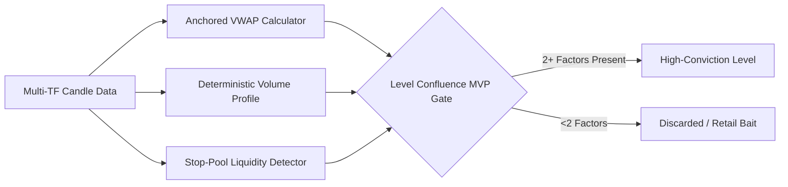

# TradePulse Operational & User System Guide

This document is the definitive operational manual for **TradePulse**, detailing how day traders interact with the system across daily trading sessions, pre-market preparation, AI level identification, live voice assistance, order execution, simulation replays, and trade journaling.

---

## 1. Daily Trading Desk Lifecycle

TradePulse strictly structures the day trader’s workflow to enforce professional risk management and eliminate emotional over-trading.

```mermaid
timeline
    title Daily Trading Desk Timeline (US Eastern Time)
    7:00 AM - 9:00 AM : Pre-Market Prep : Auto Level Prep & News Sentiment Retrieval
    9:00 AM - 9:30 AM : Pre-Market Clock-In & Live Voice : Desk Attendance & Voice Co-Pilot Opens (30 min before open)
    9:15 AM - 9:30 AM : Instrument Lock : Market Regime Check & Instrument Selection (DOW vs NASDAQ)
    9:30 AM - 10:15 AM : Core Entry Window : Level Order Fills (Single Position Enforced)
    10:15 AM - 11:30 AM : Active Management : SL/TP Tracking, Reversal AI Exits
    11:30 AM - 1:00 PM : Lunch Flatten : Session Risk Lockout (3 Max Stop Hits Trigger Shutdown)
    1:00 PM - 4:00 PM : Afternoon Playbook : Trend Continuation / Range Reversals
    4:00 PM - 5:00 PM : EOD Journaling : Performance Rating, Execution Audits & Audio Review
```

### Session Phases Breakdown

1. **PREP & VOICE Phase (Opens 30 Minutes Before Open: 9:00 AM ET / 08:30 AM JST)**:
   - Live Voice co-pilot opens 30 minutes prior to cash open.
   - System automatically aggregates higher-timeframe candles ($D$, $4H$, $1H$).
   - Computes Anchored VWAP (AVWAP), Volume Profile (POC/HVN), and Stop-pool liquidity zones.
   - Claude Level Finder Agent identifies $2–5$ high-conviction key levels.
2. **RECOMMENDED Phase (9:15 AM – 9:30 AM ET)**:
   - Automated regime analysis compares momentum and news sentiment across DOW (`^DJI`) and NASDAQ (`^IXIC`).
   - Locks the target trading instrument for the day.
3. **ENTRY Window (9:30 AM – 10:15 AM ET)**:
   - Interactive chart highlights active entry levels. Fills are enabled only within this 45-minute window.
   - Limit entries submitted via the Level Order Ticket ([`app/dashboard/chart/components/LevelOrderTicket.tsx`](file:///c:/Users/shahb/myApplications/Trading/app/dashboard/chart/components/LevelOrderTicket.tsx)).
4. **MANAGE Phase (Post-Fill until Exit)**:
   - Strict monitoring of Stop-Loss (SL) and Take-Profit (TP).
   - Real-time AI Reversal evaluation (`/api/trading/positions/ai-exit`).
5. **DONE Phase**:
   - Triggered automatically if:
     - Take-Profit target is hit.
     - Maximum 3 Stop-Loss hits occur in a single session.
     - Lunch safety flatten occurs at 11:30 AM ET.

---

## 2. Desk Attendance & Discipline Rules

To prevent impulsive trading, TradePulse enforces strict attendance and discipline gates ([`lib/trading/deskAttendance.ts`](file:///c:/Users/shahb/myApplications/Trading/lib/trading/deskAttendance.ts)):

- **Clock-In Requirement**: Traders must explicitly clock into the desk prior to placing orders (`POST /api/trading/clock-in`).
- **Single Active Position Rule**: Only **one** open position is allowed at any time. Attempts to open concurrent trades are rejected by the position gate ([`lib/trading/positionManager.ts`](file:///c:/Users/shahb/myApplications/Trading/lib/trading/positionManager.ts)).
- **Mandatory Stop-Loss & Take-Profit**: Every position must include explicit price boundaries. Floating or unhedged entries are impossible.
- **Max 3 Stop Limit**: Experiencing 3 Stop-Loss hits automatically locks the trading desk until the next calendar session.

---

## 3. Institutional Technical Analysis & Level Identification

TradePulse avoids primitive retail indicators (e.g. moving average crosses) in favor of institutional market structure:



### Technical Pillars

1. **Anchored VWAP (AVWAP)** ([`lib/chart/sessionVwap.ts`](file:///c:/Users/shahb/myApplications/Trading/lib/chart/sessionVwap.ts)):
   - Calculates volume-weighted average price anchored to major market events (Market Open, Weekly High/Low, Session Start).
   - Generates $\pm 1\sigma$ and $\pm 2\sigma$ standard deviation volatility bands.
2. **Volume Profile (POC & HVN)** ([`lib/chart/volumeProfile.ts`](file:///c:/Users/shahb/myApplications/Trading/lib/chart/volumeProfile.ts)):
   - Analyzes price-by-volume distribution to extract the **Point of Control (POC)** (price with maximum traded volume) and **High Volume Nodes (HVN)**.
3. **Stop-Pool Liquidity Pools**:
   - Identifies clustered stop-loss orders lying just beyond retail swing highs/lows where institutional sweep events occur.
4. **Confluence Filter**:
   - Only levels supported by **at least 2 out of the 3 pillars** are displayed on the chart and saved to `identified_levels`.

---

## 4. Live Voice AI Assistant & Chart Controls

The **Live Voice Assistant** ([`app/dashboard/chart/components/LiveVoicePanel.tsx`](file:///c:/Users/shahb/myApplications/Trading/app/dashboard/chart/components/LiveVoicePanel.tsx)) acts as a co-pilot during active trading hours.

### Capabilities:
- **Real-Time Level Proximity Alerts**: Verbally alerts the trader as price approaches a key support/resistance zone (e.g. *"DOW is 8 pips away from 4H Support at 39,250"*).
- **Position & Risk Speech Updates**: Spoken updates on open P&L, stop-loss distance, and target progress.
- **Voice Commands**: Traders can query the assistant verbally or trigger voice context sync (`POST /api/trading/live-voice/react`).
- **Audio Engine**: Powered by OpenAI Speech API (`alloy`/`echo` voices) with fallback to browser SpeechSynthesis.

---

## 5. Simulation Replay Engine

For off-hours practice and strategy backtesting, TradePulse features an interactive **Market Simulation Replay Engine** ([`app/dashboard/simulation/page.tsx`](file:///c:/Users/shahb/myApplications/Trading/app/dashboard/simulation/page.tsx)):

- **Historical Playback**: Replays past session price tick-by-tick.
- **Speed Multipliers**: Adjustable playback speeds ($0.25\times, 0.5\times, 1.0\times, 2.0\times, 4.0\times$).
- **Replay Caching**: Caches historical market availability in `replay_availability_cache` for fast loading.
- **Simulated Execution**: Executes simulated positions with full P&L tracking without affecting live journal stats.

---

## 6. End-of-Day Journal & Performance Analytics

After session close, traders perform structured end-of-day reviews ([`app/dashboard/journal/page.tsx`](file:///c:/Users/shahb/myApplications/Trading/app/dashboard/journal/page.tsx)):

- **Execution Discipline Score**: Rates adherence to entry rules, stop placements, and emotional control.
- **P&L Metrics**: Tracking in pips and dollars.
- **Level Reaction Accuracy**: Evaluates how accurately identified levels held or broke during market hours.
- **LLM Usage & Cost Analytics** ([`app/dashboard/usage/page.tsx`](file:///c:/Users/shahb/myApplications/Trading/app/dashboard/usage/page.tsx)): Transparent view of token usage and API costs across Claude, Gemini, and OpenAI services.
