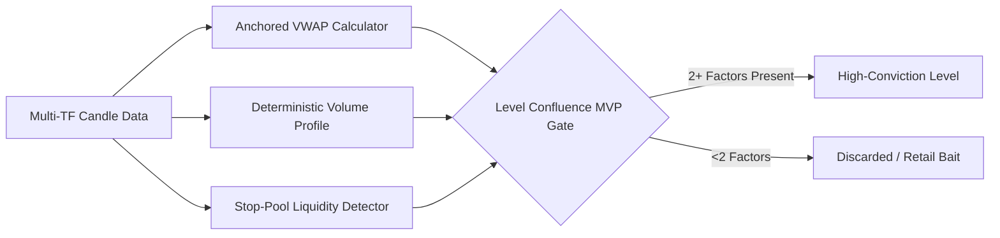

# TradePulse Operational & User System Guide

This document is the definitive operational manual for **TradePulse**, detailing how day traders interact with the system across daily trading sessions, pre-market preparation, AI level identification, live voice assistance, order execution, simulation replays, and trade journaling.

---

## 1. Daily Trading Desk Lifecycle

TradePulse strictly structures the day trader’s workflow to enforce professional risk management and eliminate emotional over-trading.

```mermaid
timeline
    title Daily Trading Desk Timeline (US Eastern Time)
    7:00 AM - 9:00 AM : Pre-Market Prep : Auto Level Prep & News Sentiment Retrieval
    9:00 AM - 9:30 AM : Pre-Market Clock-In & Live Voice : Desk Attendance & Voice Co-Pilot Opens (30 min before open)
    9:15 AM - 9:30 AM : Instrument Lock : Market Regime Check & Instrument Selection (DOW vs NASDAQ)
    9:30 AM - 10:15 AM : Core Entry Window : Level Order Fills (Single Position Enforced)
    10:15 AM - 11:30 AM : Active Management : SL/TP Tracking, Reversal AI Exits
    11:30 AM - 1:00 PM : Lunch Flatten : Session Risk Lockout (3 Max Stop Hits Trigger Shutdown)
    1:00 PM - 4:00 PM : Afternoon Playbook : Trend Continuation / Range Reversals
    4:00 PM - 5:00 PM : EOD Journaling : Performance Rating, Execution Audits & Audio Review
```

### Session Phases Breakdown

1. **PREP & VOICE Phase (Opens 30 Minutes Before Open: 9:00 AM ET / 08:30 AM JST)**:
   - Live Voice co-pilot opens 30 minutes prior to cash open.
   - System automatically aggregates higher-timeframe candles ($D$, $4H$, $1H$).
   - Computes Anchored VWAP (AVWAP), Volume Profile (POC/HVN), and Stop-pool liquidity zones.
   - Claude Level Finder Agent identifies $2–5$ high-conviction key levels.
2. **RECOMMENDED Phase (9:15 AM – 9:30 AM ET)**:
   - Automated regime analysis compares momentum and news sentiment across DOW (`^DJI`) and NASDAQ (`^IXIC`).
   - Locks the target trading instrument for the day.
3. **ENTRY Window (9:30 AM – 10:15 AM ET)**:
   - Interactive chart highlights active entry levels. Fills are enabled only within this 45-minute window.
   - Limit entries submitted via the Level Order Ticket ([`app/dashboard/chart/components/LevelOrderTicket.tsx`](file:///c:/Users/shahb/myApplications/Trading/app/dashboard/chart/components/LevelOrderTicket.tsx)).
4. **MANAGE Phase (Post-Fill until Exit)**:
   - Strict monitoring of Stop-Loss (SL) and Take-Profit (TP).
   - Real-time AI Reversal evaluation (`/api/trading/positions/ai-exit`).
5. **DONE Phase**:
   - Triggered automatically if:
     - Take-Profit target is hit.
     - Maximum 3 Stop-Loss hits occur in a single session.
     - Lunch safety flatten occurs at 11:30 AM ET.

---

## 2. Desk Attendance & Discipline Rules

To prevent impulsive trading, TradePulse enforces strict attendance and discipline gates ([`lib/trading/deskAttendance.ts`](file:///c:/Users/shahb/myApplications/Trading/lib/trading/deskAttendance.ts)):

- **Clock-In Requirement**: Traders must explicitly clock into the desk prior to placing orders (`POST /api/trading/clock-in`).
- **Single Active Position Rule**: Only **one** open position is allowed at any time. Attempts to open concurrent trades are rejected by the position gate ([`lib/trading/positionManager.ts`](file:///c:/Users/shahb/myApplications/Trading/lib/trading/positionManager.ts)).
- **Mandatory Stop-Loss & Take-Profit**: Every position must include explicit price boundaries. Floating or unhedged entries are impossible.
- **Max 3 Stop Limit**: Experiencing 3 Stop-Loss hits automatically locks the trading desk until the next calendar session.

---

## 3. Institutional Technical Analysis & Level Identification

TradePulse avoids primitive retail indicators (e.g. moving average crosses) in favor of institutional market structure:



### Technical Pillars

1. **Anchored VWAP (AVWAP)** ([`lib/chart/sessionVwap.ts`](file:///c:/Users/shahb/myApplications/Trading/lib/chart/sessionVwap.ts)):
   - Calculates volume-weighted average price anchored to major market events (Market Open, Weekly High/Low, Session Start).
   - Generates $\pm 1\sigma$ and $\pm 2\sigma$ standard deviation volatility bands.
2. **Volume Profile (POC & HVN)** ([`lib/chart/volumeProfile.ts`](file:///c:/Users/shahb/myApplications/Trading/lib/chart/volumeProfile.ts)):
   - Analyzes price-by-volume distribution to extract the **Point of Control (POC)** (price with maximum traded volume) and **High Volume Nodes (HVN)**.
3. **Stop-Pool Liquidity Pools**:
   - Identifies clustered stop-loss orders lying just beyond retail swing highs/lows where institutional sweep events occur.
4. **Confluence Filter**:
   - Only levels supported by **at least 2 out of the 3 pillars** are displayed on the chart and saved to `identified_levels`.

---

## 4. Advanced Chart Controls, Shortcuts & Tools

TradePulse features a high-performance chart dashboard built on top of Lightweight Charts. It provides institutional-grade drawing tools, keyboard hotkeys, and automated scaling to keep you locked into market action.

### 2D Drag-to-Draw Zone Tool
* **Interactive Range Drawing (Hotkeys: `D` or click toolbar)**: Hovering or clicking the `Draw Zone` tool switches the cursor to crosshair mode. On `mousedown`, you can drag in 2D to expand a blue zone (`#3b82f6`) with real-time High/Low index prices and 8 active control handles.
* **Send to Leo**: Letting go of the mouse locks the zone on screen and pops open a **"Send to Leo"** co-pilot banner. Confirming it uploads the drawn range coordinates as context for your AI co-pilot.
* **Dismiss / Cancel**: Press **`Esc`** or click **`Cancel`** to discard the drawn range at any time.

### Highlight Time Range Tool
* **Interactive Time Highlights (Hotkeys: `T` or click toolbar)**: Drag horizontally to select a custom time span (e.g. from 10:15 JST to 11:30 JST) on the chart.
* **Send Time to Leo**: Letting go of the mouse locks a semi-transparent purple selection box on screen and displays a **"Send Time to Leo"** popup. Clicking it asks Leo to analyze the OHLCV candlestick bodies, volume, and patterns during that highlighted period. Leo immediately replies with spoken audio feedback.

### TradingView Interactive Risk/Reward Box Tool
* **Interactive Position Risk Tool (Hotkeys: `T` or click toolbar)**: Drops an interactive 3-line Risk/Reward tool directly onto the chart (Entry, Stop Loss, Take Profit).
* **Automatic 1% Position Sizing**: As you move the Stop Loss or Entry price lines, position size automatically recalculates: `units = (Account * 0.01) / |Entry - SL|` to enforce 1.0% account risk.
* **TradingView Control Badges**: Renders the exact TradingView order pill badges (`[ Buy / Sell ]`, `[ Units | Limit | ✕ ]`, `[ Units | +$482.53 | ✕ ]`, `[ Units | -$100.00 (1.0%) | ✕ ]`).
* **Smart Trade Journaling Automation**:
  * **With Leo**: If you discussed the level with Leo during the session, the system automatically writes Leo's co-pilot evaluation into the `trades_journal` entry reason.
  * **Without Leo (Pure Manual)**: Clicking `Limit` / `Place 1% Limit Order` prompts you with a mandatory rationale modal (*"Why did you choose this zone and set this SL/TP?"*) before submitting the order to ensure your trade log is 100% complete.

### Single-Key Keyboard Shortcuts
For maximum efficiency under high volatility, single-key toggles let you quickly display or hide UI elements without moving your mouse:

| Hotkey | Target Component | Action |
| :---: | :--- | :--- |
| **`V`** | **Voice Coach Panel** | Toggles the Live Voice chat panel on or off. |
| **`L`** | **Levels Overlay** | Toggles the display of AI & Structure level lines on the chart. |
| **`P`** | **Morning Playbook** | Toggles the Morning Playbook / Afternoon Watchbook widget open or closed. |
| **`D`** | **Draw Zone Tool** | Activates the 2D Drag-to-Draw zone tool (press again or `Esc` to cancel). |
| **`T`** | **Risk Box Tool** | Activates the TradingView Interactive Limit Order Risk Box (press again or `Esc` to cancel). |
| **`F`** | **Fullscreen Chart** | Toggles 100% Fullscreen Mode. |
| **`Esc`**| **Cancel / Exit** | Exits Fullscreen mode, cancels active tools, or closes manual order tickets. |

*Shortcuts are automatically bypassed while typing in input fields, textareas, or dropdown selects.*

### Visible Candle Autoscale
* **TradingView-Style Scaling**: Instead of compressing candlesticks using the entire 5-day historical dataset, the chart calculates candle highs and lows strictly from the **currently visible logical range** on screen. As you scroll or zoom, the chart dynamically auto-scales vertically to keep candlestick bodies and wicks clear and readable.

### Playbook Dismissal Persistence
* **Close State Memory**: Once you click `✕` on the Morning Playbook or Afternoon Watchbook widget (or toggle it off via `P`), the closed state is saved in memory. Background database level polling will **never auto-reopen** the widget on your screen. The playbook will only reappear when you manually request it.

### Centered Order Ticket Modal
* **Unclipped Modal Overlay**: The manual limit order ticket (`LevelOrderTicket.tsx`) opens as a centered modal with a dark translucent background. It features a prominent red `✕ Close` badge, a bottom `Cancel` button, and supports full `Esc` key dismissals.

---

## 5. Simulation Replay Engine

For off-hours practice and strategy backtesting, TradePulse features an interactive **Market Simulation Replay Engine** ([`app/dashboard/simulation/page.tsx`](file:///c:/Users/shahb/myApplications/Trading/app/dashboard/simulation/page.tsx)):

- **Historical Playback**: Replays past session price tick-by-tick.
- **Speed Multipliers**: Adjustable playback speeds ($0.25\times, 0.5\times, 1.0\times, 2.0\times, 4.0\times$).
- **Replay Caching**: Caches historical market availability in `replay_availability_cache` for fast loading.
- **Simulated Execution**: Executes simulated positions with full P&L tracking without affecting live journal stats.

---

## 6. End-of-Day Journal & Performance Analytics

After session close, traders perform structured end-of-day reviews ([`app/dashboard/journal/page.tsx`](file:///c:/Users/shahb/myApplications/Trading/app/dashboard/journal/page.tsx)):

- **Execution Discipline Score**: Rates adherence to entry rules, stop placements, and emotional control.
- **P&L Metrics**: Tracking in pips and dollars.
- **Level Reaction Accuracy**: Evaluates how accurately identified levels held or broke during market hours.
- **LLM Usage & Cost Analytics** ([`app/dashboard/usage/page.tsx`](file:///c:/Users/shahb/myApplications/Trading/app/dashboard/usage/page.tsx)): Transparent view of token usage and API costs across Claude, Gemini, and OpenAI services.
