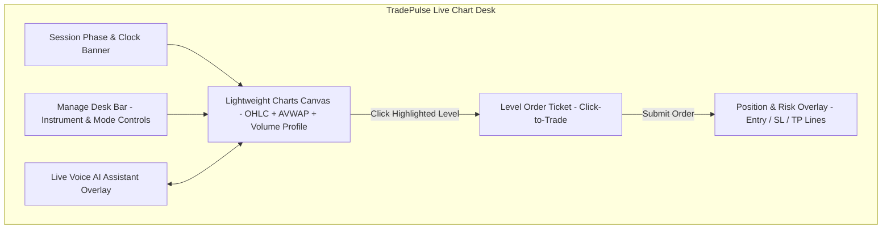
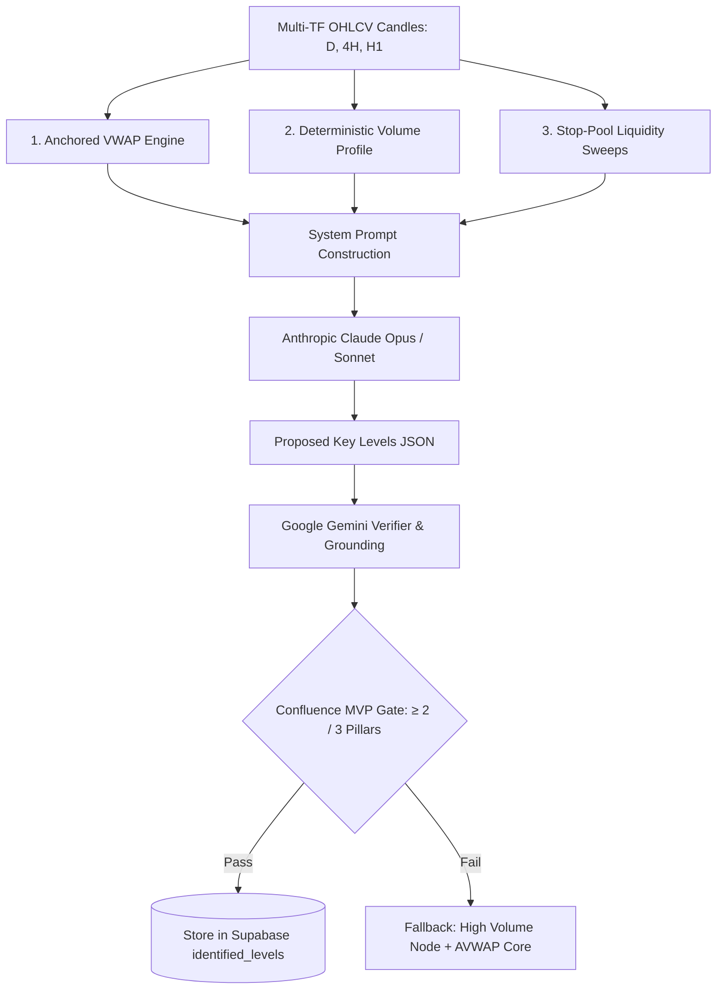
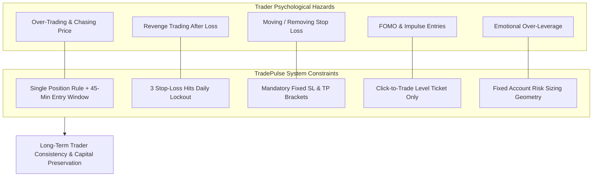

# Live Trading Chart, AI Level Finder Tools & Trading Psychology Guide

This guide details the **Live Trading Chart features**, the **institutional AI Level Finder tools**, and the **Trading Psychology & Discipline Framework** built into TradePulse to create consistent, profitable day traders.

---

## 1. Live Trading Chart & Interface Features

The TradePulse Chart Desk ([`app/dashboard/chart/page.tsx`](file:///c:/Users/shahb/myApplications/Trading/app/dashboard/chart/page.tsx)) provides an institutional trading terminal built on top of `lightweight-charts`.

### 1.1 Core Chart Terminal Components

1. **Interactive Financial Chart Engine** ([`TradingChart.tsx`](file:///c:/Users/shahb/myApplications/Trading/app/dashboard/chart/components/TradingChart.tsx)):
   - Renders real-time OHLC candlestick data for DOW (`^DJI`) and NASDAQ (`^IXIC`).
   - Overlays **Anchored VWAP (AVWAP)** lines with upper/lower $\pm 1\sigma$ and $\pm 2\sigma$ volatility bands.
   - Renders **Volume Profile histograms** on the right Y-axis, highlighting the **Point of Control (POC)** and **High Volume Nodes (HVN)**.
   - Dynamically plots AI-identified support (green), resistance (red), and VWAP (purple) price levels with conviction badges ($1–10$).
2. **Session Phase & Desk Clock Banner** ([`SessionBanner.tsx`](file:///c:/Users/shahb/myApplications/Trading/app/dashboard/chart/components/SessionBanner.tsx)):
   - Real-time status indicator showing current session phase: `PREP`, `RECOMMENDED`, `ENTRY`, `MANAGE`, `FLAT`, or `DONE`.
   - Displays locked instrument, current session message, countdown timers, and clock-in status.
3. **Level Order Ticket** ([`LevelOrderTicket.tsx`](file:///c:/Users/shahb/myApplications/Trading/app/dashboard/chart/components/LevelOrderTicket.tsx)):
   - Modal ticket launched automatically when a trader clicks any identified level on the chart.
   - Pre-calculates entry price, stop-loss distance, take-profit target (default 1.5:1 to 2:1 Risk/Reward ratio), and recommended position sizing.
   - Allows instant single-click entry (`DEEP LONG` or `DEEP SHORT`).
4. **Live Position & Risk Overlay**:
   - Visualizes open position entry line, real-time unrealized P&L (in pips and USD), active Stop-Loss (SL) line, and Take-Profit (TP) target line directly on the chart canvas.
5. **Live Voice Assistant Panel** ([`LiveVoicePanel.tsx`](file:///c:/Users/shahb/myApplications/Trading/app/dashboard/chart/components/LiveVoicePanel.tsx)):
   - Floating co-pilot widget providing audio context, pinned level warnings, and conversational text-to-speech interaction during active trading hours.

---

## 2. AI Level Finder: Institutional Tools & Data Models

The TradePulse AI Level Finder Agent ([`lib/services/levelFinderAgent/levelFinderAgent.ts`](file:///c:/Users/shahb/myApplications/Trading/lib/services/levelFinderAgent/levelFinderAgent.ts)) does not rely on simple retail indicators. Instead, it utilizes an institutional quantitative pipeline:

### 2.1 Technical Tools Provided to the AI

| Technical Tool | Operational Function & Calculation | Significance to Level Finder |
| :--- | :--- | :--- |
| **Anchored VWAP (AVWAP)** | Computes Volume-Weighted Average Price anchored to key structural pivot points (Session Open, Weekly High/Low) along with $\pm 1\sigma, \pm 2\sigma$ standard deviation bands ([`lib/chart/sessionVwap.ts`](file:///c:/Users/shahb/myApplications/Trading/lib/chart/sessionVwap.ts)). | Identifies institutional average price position and high-probability mean-reversion or breakout bounds. |
| **Volume Profile (POC & HVN)** | Calculates price-by-volume distribution to extract Point of Control (POC) and High Volume Nodes (HVN) ([`lib/chart/volumeProfile.ts`](file:///c:/Users/shahb/myApplications/Trading/lib/chart/volumeProfile.ts)). | Pinpoints exact price levels where institutional order flow accumulated, acting as strong magnet/reaction zones. |
| **Stop-Pool Liquidity Sweeps** | Scans historical candles for swing highs/lows where retail stop-losses concentrate just beyond key levels. | Detects liquidity sweep zones where market makers push price to trigger stops before reversing. |
| **Multi-Timeframe Structure** | Concurrently analyzes Daily ($D$), 4-Hour ($4H$), and 1-Hour ($H1$) price action. | Ensures levels have higher-timeframe confluence and are not isolated micro-noise. |

### 2.2 LLM Model Hierarchy & Grounding Controls

1. **Model Selection**:
   - **Production Desk**: Powered by **Anthropic Claude 3.5 Sonnet / Opus** (`claude-opus-4-8`) for maximum price action reasoning accuracy.
   - **Simulation Desk**: Powered by **Claude 3.5 Haiku** for high-speed simulation replays.
2. **Numerical Grounding** ([`lib/llm/antiHallucination.ts`](file:///c:/Users/shahb/myApplications/Trading/lib/llm/antiHallucination.ts)):
   - Every level generated by the AI is mathematically verified against actual candle high/low boundaries to prevent price level hallucinations.
3. **Gemini Verifier** ([`lib/llm/verifier.ts`](file:///c:/Users/shahb/myApplications/Trading/lib/llm/verifier.ts)):
   - Cross-checks candidate levels with an independent LLM verifier (`gemini-2.0-flash`) to confirm structural relevance before approval.
4. **Confluence MVP Gate** ([`lib/trading/levelConfluence.ts`](file:///c:/Users/shahb/myApplications/Trading/lib/trading/levelConfluence.ts)):
   - Requires that candidate levels match **at least 2 of the 3 institutional pillars** (AVWAP, POC/HVN, Stop Pools). Single-factor candidate levels are automatically discarded as "retail bait".

---

## 3. System Psychology & Consistency Framework

Most day traders fail not due to a lack of technical knowledge, but due to psychological flaws: **over-trading, revenge trading, lack of discipline, moving stop-losses, FOMO, and emotional execution**. 

TradePulse is hardcoded to act as a **psychological circuit breaker** that forces consistency.

### 3.1 Hardcoded Consistency Rules

#### 1. Eliminating Over-Trading (The 45-Minute Window & Single Position Lock)
- **Problem**: Retail traders trade all day, over-leveraging during low-liquidity hours and giving back morning gains.
- **TradePulse Fix**: 
  - **45-Minute Window**: Limit order entries are strictly allowed **only between 9:30 AM and 10:15 AM ET**. Outside this window, entry triggers are locked (`canEnter = false`).
  - **Single Position Lock**: The position manager ([`lib/trading/positionManager.ts`](file:///c:/Users/shahb/myApplications/Trading/lib/trading/positionManager.ts)) strictly limits the user to **1 open position per session**. Opening a second position while one is active is impossible.

#### 2. Eliminating Revenge Trading (The 3 Stop-Loss Daily Lockout Rule)
- **Problem**: After experiencing a losing trade, traders enter emotional "revenge trades" to get back to breakeven, leading to catastrophic drawdown.
- **TradePulse Fix**: 
  - The system tracks stop-loss hits via `POST /api/trading/positions/stop-loss-hit`.
  - Upon experiencing **3 Stop-Loss hits in a single day**, the desk phase transitions automatically to `DONE` and completely locks out trading until the next calendar day.

#### 3. Eliminating Emotional Order Management (Mandatory Brackets & AI Exit)
- **Problem**: Traders widen or remove stop-losses when price approaches them, turning small losses into account-wiping disasters.
- **TradePulse Fix**: 
  - Positions **must** be submitted with mandatory Stop-Loss and Take-Profit parameters. Unprotected orders are rejected.
  - Stop-loss execution is handled automatically by the server/broker engine. 
  - An intelligent **AI Exit agent** (`/api/trading/positions/ai-exit`) evaluates real-time market sentiment and liquidates positions early if a genuine market reversal occurs, taking emotion out of management.

#### 4. Eliminating Impulsive FOMO Entries (Click-Level Ticket & Clock-In)
- **Problem**: Traders chase green or red market candles impulse-buying at market highs/lows.
- **TradePulse Fix**: 
  - Traders must explicitly **clock into the desk** before trading ([`lib/trading/deskAttendance.ts`](file:///c:/Users/shahb/myApplications/Trading/lib/trading/deskAttendance.ts)).
  - Trades can **only** be placed by clicking on pre-identified, AI-validated technical levels on the chart. Market chasing is eliminated.

#### 5. Reducing Cognitive Load & Emotional Stress (Live Voice AI Assistant)
- **Problem**: Staring at fluctuating P&L causes anxiety and leads to premature exits.
- **TradePulse Fix**: 
  - The **Live Voice Assistant** acts as a calm, objective desk partner. It reads distance to key levels and objective position statistics verbally, keeping the trader disciplined and relaxed.

#### 6. Building Habitual Accountability (End-of-Day Journaling)
- **Problem**: Traders close their laptops after trading without analyzing execution discipline.
- **TradePulse Fix**: 
  - Daily session close requires completing the **End-of-Day Journal** ([`app/dashboard/journal/page.tsx`](file:///c:/Users/shahb/myApplications/Trading/app/dashboard/journal/page.tsx)).
  - Forces traders to rate their **Execution Discipline Score**, log trade notes, and review level reaction accuracy, building long-term psychological resilience.
